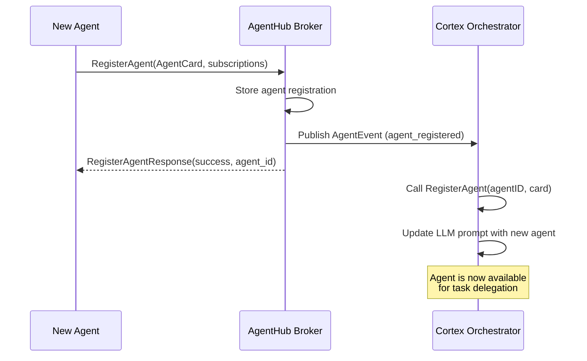
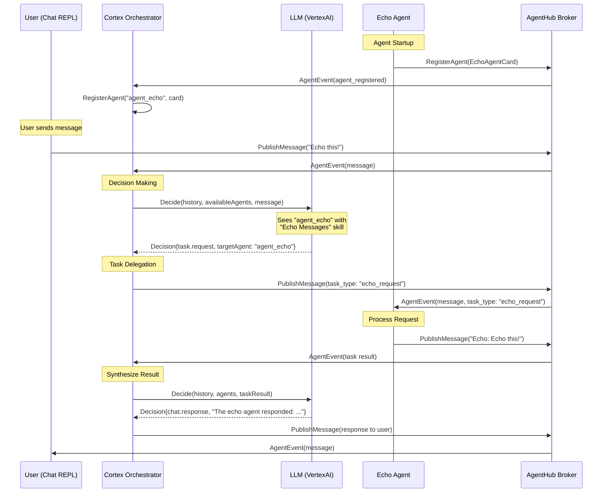

# Agent Registration and Dynamic Discovery Specification

## Overview

This specification describes the workflow for dynamic agent discovery in AgentHub, where:
1. Agents register themselves by sending their AgentCard to the broker
2. The Cortex orchestrator subscribes to agent card events
3. Cortex dynamically updates its LLM system prompt with available agents
4. The LLM can then make informed decisions about which agents to delegate tasks to

## Workflow

### 1. Agent Registration Flow

When an agent starts up and connects to the AgentHub broker:



### 2. Agent Card Structure

Based on the A2A protocol (defined in `proto/a2a_core.proto`), an AgentCard contains:

```protobuf
message AgentCard {
  string protocol_version = 1;            // A2A protocol version (e.g., "0.2.9")
  string name = 2;                        // Unique agent identifier
  string description = 3;                 // Human-readable description
  string url = 4;                         // Primary service endpoint (optional)
  string preferred_transport = 5;         // Preferred transport protocol
  repeated AgentInterface additional_interfaces = 6;
  AgentProvider provider = 7;
  string version = 8;                     // Agent version
  string documentation_url = 9;
  AgentCapabilities capabilities = 10;    // Streaming, push notifications, etc.
  repeated AgentSkill skills = 11;        // List of agent skills/capabilities
  bool supports_authenticated_extended_card = 12;
  string icon_url = 13;
}

message AgentSkill {
  string id = 1;                          // Unique skill identifier
  string name = 2;                        // Human-readable skill name
  string description = 3;                 // Detailed skill description
  repeated string tags = 4;               // Categorization tags
  repeated string examples = 5;           // Example queries/requests
  repeated string input_modes = 6;        // Supported input MIME types
  repeated string output_modes = 7;       // Supported output MIME types
}
```

### 3. Message Type Convention

To enable proper routing and filtering, agents should use a standardized message metadata convention:

**Message Metadata Fields:**
- `task_type`: Identifies the type of task (e.g., "echo_request", "translation_request", "data_analysis")
- `agent_id`: The agent identifier (matches the AgentCard name)
- `task_id`: Correlation ID for tracking task lifecycle

**Example Message Structure:**
```go
message := &pb.Message{
    MessageId: "msg_unique_id",
    ContextId: "conversation_context_id",
    TaskId:    "task_correlation_id",
    Role:      pb.Role_ROLE_USER,
    Content: []*pb.Part{
        {Part: &pb.Part_Text{Text: "Hello, world!"}},
    },
    Metadata: &structpb.Struct{
        Fields: map[string]*structpb.Value{
            "task_type": structpb.NewStringValue("echo_request"),
            "requester": structpb.NewStringValue("user_agent"),
        },
    },
}
```

### 4. Cortex Integration

The Cortex orchestrator needs to:

1. **Subscribe to Agent Registration Events**
   - Listen for `AgentEvent` with agent registration information
   - Store registered agents in its internal registry

2. **Dynamic Prompt Generation**
   - Build the LLM system prompt dynamically based on registered agents
   - Include agent names, descriptions, and skills
   - Enable the LLM to make informed delegation decisions

**Current Implementation (in `agents/cortex/llm/vertexai/client.go:152-182`):**
```go
func (c *Client) buildOrchestrationPrompt(
    conversationHistory []*pb.Message,
    availableAgents []*pb.AgentCard,
    newEvent *pb.Message,
) string {
    // System instructions
    prompt.WriteString("You are Cortex, an AI orchestrator...\n\n")

    // List available agents
    if len(availableAgents) > 0 {
        prompt.WriteString("Available agents:\n")
        for _, agent := range availableAgents {
            prompt.WriteString(fmt.Sprintf("- %s: %s\n",
                agent.GetName(), agent.GetDescription()))

            if len(agent.GetSkills()) > 0 {
                prompt.WriteString("  Skills:\n")
                for _, skill := range agent.GetSkills() {
                    prompt.WriteString(fmt.Sprintf("    * %s: %s\n",
                        skill.GetName(), skill.GetDescription()))
                }
            }
        }
    }
    // ... rest of prompt
}
```

## Complete Example: Echo Agent

### Echo Agent Specification

**Purpose:** A simple echo agent that repeats back messages for testing purposes

**Agent Card:**
```go
agentCard := &pb.AgentCard{
    ProtocolVersion: "0.2.9",
    Name:            "agent_echo",
    Description:     "A simple echo agent that repeats back messages for testing purposes",
    Version:         "1.0.0",
    Capabilities: &pb.AgentCapabilities{
        Streaming:         false,
        PushNotifications: false,
    },
    Skills: []*pb.AgentSkill{
        {
            Id:          "echo",
            Name:        "Echo Messages",
            Description: "Echoes back any text message with an 'Echo: ' prefix",
            Tags:        []string{"testing", "echo", "debug"},
            Examples: []string{
                "Echo this message",
                "Repeat what I say",
                "Test echo functionality",
            },
            InputModes:  []string{"text/plain"},
            OutputModes: []string{"text/plain"},
        },
    },
}
```

### Expected Message Types

The echo agent subscribes to and processes messages with:
- **task_type**: `"echo_request"` or `"echo"`
- **Role**: `ROLE_USER` or `ROLE_AGENT`
- **Content**: Text parts that will be echoed back

### Registration Code

```go
// Register agent with broker
_, err = client.Client.RegisterAgent(ctx, &pb.RegisterAgentRequest{
    AgentCard:     agentCard,
    Subscriptions: []string{"echo_request"},  // Topic-based subscription
})
```

### Message Processing Logic

```go
// Subscribe to messages
stream, err := client.Client.SubscribeToMessages(ctx, &pb.SubscribeToMessagesRequest{
    AgentId: "agent_echo",
})

for {
    event, err := stream.Recv()

    if messageEvent := event.GetMessage(); messageEvent != nil {
        // Check if this is an echo request
        if messageEvent.Metadata != nil {
            if taskType, exists := messageEvent.Metadata.Fields["task_type"]; exists {
                if taskType.GetStringValue() == "echo_request" ||
                   taskType.GetStringValue() == "echo" {
                    handleEchoRequest(ctx, client, messageEvent)
                }
            }
        }
    }
}
```

### Response Message Format

```go
responseMessage := &pb.Message{
    MessageId: fmt.Sprintf("msg_echo_response_%d", time.Now().Unix()),
    ContextId: originalMessage.GetContextId(),  // Maintain conversation context
    TaskId:    originalMessage.GetTaskId(),     // Maintain task correlation
    Role:      pb.Role_ROLE_AGENT,
    Content: []*pb.Part{
        {Part: &pb.Part_Text{
            Text: fmt.Sprintf("Echo: %s", inputText),
        }},
    },
    Metadata: &structpb.Struct{
        Fields: map[string]*structpb.Value{
            "task_type":           structpb.NewStringValue("echo_result"),
            "echo_agent":          structpb.NewStringValue("agent_echo"),
            "original_message_id": structpb.NewStringValue(originalMessage.GetMessageId()),
            "created_at":          structpb.NewStringValue(time.Now().Format(time.RFC3339)),
        },
    },
}
```

## Implementation Tasks

To implement this specification, the following changes are needed:

### 1. Broker Enhancement
- [ ] Publish agent registration events when `RegisterAgent` is called
- [ ] Create an `AgentEvent` with payload type for agent registration
- [ ] Add agent card to the event metadata

### 2. Cortex Enhancement
- [ ] Subscribe to agent registration events
- [ ] Handle agent registration events by calling `RegisterAgent(agentID, card)`
- [ ] Ensure the LLM prompt generation uses the dynamically registered agents
- [ ] Handle agent deregistration/heartbeat (future enhancement)

### 3. Agent Implementation Guidelines
- [ ] All agents should send their AgentCard during startup via `RegisterAgent`
- [ ] AgentCards should include detailed Skills with examples
- [ ] Use standardized metadata fields (`task_type`, `agent_id`, etc.)
- [ ] Maintain ContextId and TaskId for proper correlation

### 4. Testing Strategy
- [ ] Unit tests for Cortex agent registration handling
- [ ] Integration tests for dynamic agent discovery
- [ ] End-to-end test: Start echo agent → Verify Cortex can delegate to it
- [ ] Test Cortex LLM prompt includes newly registered agents

## Message Flow Example

### Complete Interaction Sequence



## References

### Existing Code

- **Agent Card Definition**: `proto/a2a_core.proto:98-151`
- **Echo Agent Implementation**: `agents/echo_agent/main.go`
- **Cortex Agent Registration**: `agents/cortex/cortex.go:51-71`
- **LLM Prompt Building**: `agents/cortex/llm/vertexai/client.go:152-241`
- **RegisterAgent RPC**: `proto/eventbus.proto:206-223`

### A2A Protocol Documentation

- **Agent-to-Agent Principle**: `documentation/explanation/the_agent_to_agent_principle.md`
- **Hexagonal Architecture**: `docs/content/en/docs/explanation/architecture/hexagonal_a2a_architecture.md`

## Notes

### Design Decisions

1. **Why AgentCards during registration?**
   - Enables dynamic agent discovery without hardcoding agent capabilities
   - Allows the LLM to make informed decisions based on actual available agents
   - Supports hot-plugging of new agents without restarting Cortex

2. **Why Skills in AgentCard?**
   - Provides structured information for the LLM to understand agent capabilities
   - Examples help the LLM recognize when to delegate to specific agents
   - Tags enable future capability-based routing

3. **Why standardized metadata?**
   - Enables consistent message filtering and routing
   - Makes it easier for agents to identify relevant messages
   - Supports debugging and observability

### Future Enhancements

- **Agent Health Monitoring**: Track agent availability and route around failed agents
- **Capability Matching**: Automatic routing based on skill tags and input/output modes
- **Agent Versioning**: Support multiple versions of the same agent type
- **Agent Discovery API**: REST/gRPC endpoint for listing available agents
- **Dynamic Unregistration**: Handle graceful agent shutdown and removal from registry
