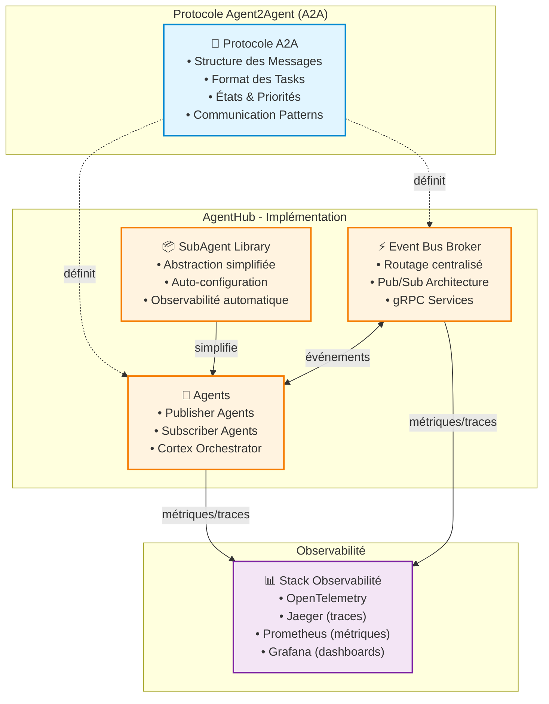
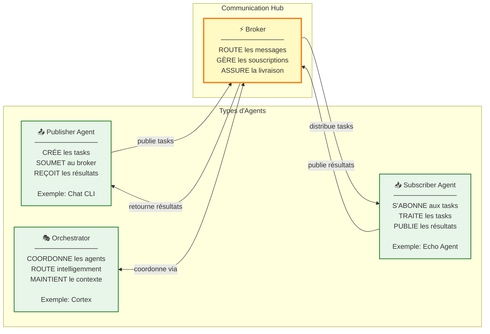
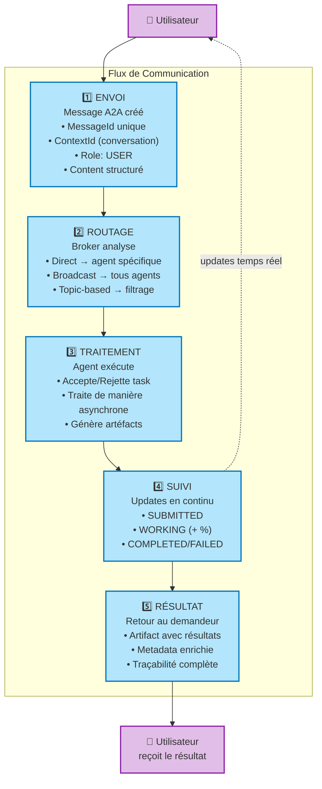
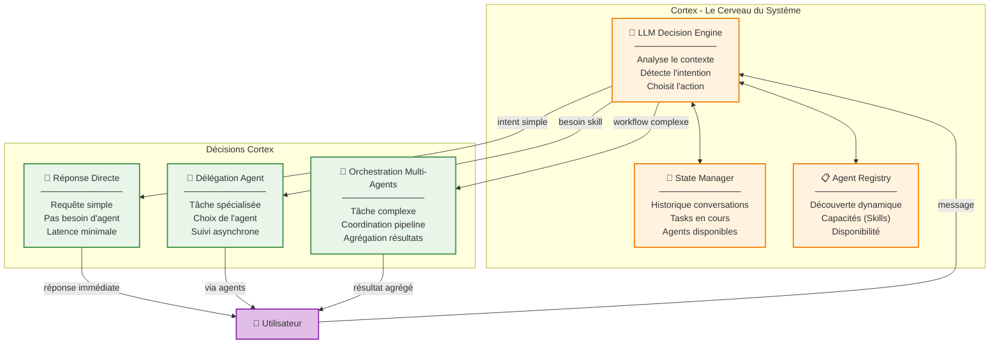
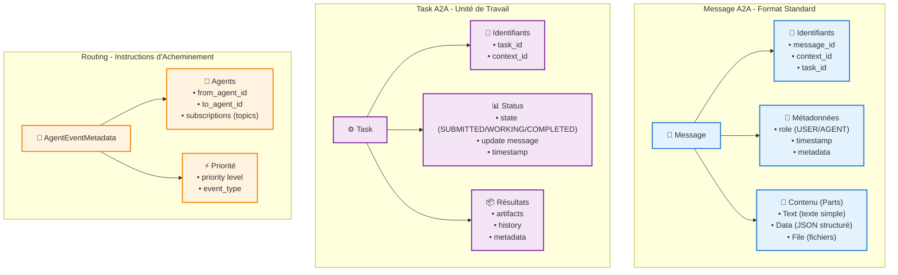
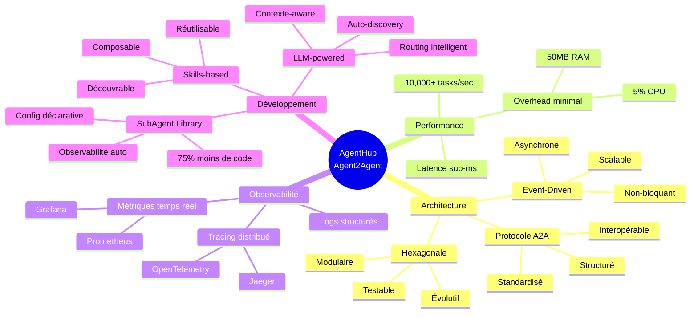
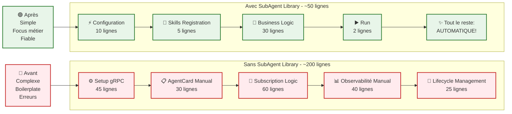
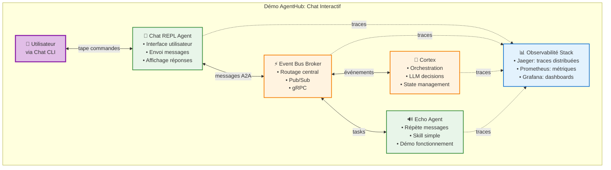
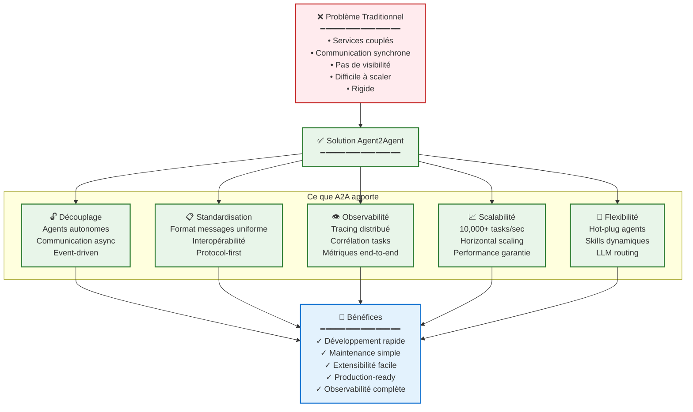

# Diagrammes Conceptuels AgentHub & Agent2Agent

Ce document présente la solution AgentHub et le protocole Agent2Agent à travers des diagrammes conceptuels qui permettent de comprendre l'architecture, les flux et les patterns sans utiliser de diagrammes de séquence.

## Table des Matières

1. [Architecture Globale: Agent2Agent avec AgentHub](#1-architecture-globale-agent2agent-avec-agenthub)
2. [Les Acteurs du Système](#2-les-acteurs-du-système)
3. [Le Workflow de Communication](#3-le-workflow-de-communication)
4. [Cortex: L'Orchestrateur Intelligent](#4-cortex-lorchest rateur-intelligent)
5. [Structure d'un Message A2A](#5-structure-dun-message-a2a)
6. [Les Avantages de la Solution](#6-les-avantages-de-la-solution)
7. [Cas d'Usage Typiques](#7-cas-dusage-typiques)
8. [De la Complexité à la Simplicité avec SubAgent](#8-de-la-complexité-à-la-simplicité-avec-subagent)
9. [Vision Globale de la Démo](#9-vision-globale-de-la-démo)

---

## 1. Architecture Globale: Agent2Agent avec AgentHub

**Points clés:**
- **Agent2Agent (A2A)** est le protocole standardisé de communication
- **AgentHub** est l'implémentation du broker et de l'infrastructure
- **SubAgent Library** simplifie le développement d'agents
- **Observabilité complète** intégrée dès le départ

---

## 2. Les Acteurs du Système

**Rôles:**
- **Publisher**: Créateur de travail qui délègue
- **Subscriber**: Exécutant spécialisé qui traite
- **Orchestrator**: Coordinateur intelligent (Cortex)
- **Broker**: Hub de communication central

---

## 3. Le Workflow de Communication

**Étapes:**
1. **Envoi**: Création d'un message A2A structuré
2. **Routage**: Le broker détermine la destination
3. **Traitement**: L'agent exécute de façon autonome
4. **Suivi**: Updates de progression en temps réel
5. **Résultat**: Retour avec traçabilité complète

---

## 4. Cortex: L'Orchestrateur Intelligent

**Cortex** est le "cerveau" qui:
- Analyse l'intention de l'utilisateur via LLM
- Maintient le contexte conversationnel
- Découvre dynamiquement les agents disponibles
- Décide de répondre directement ou déléguer
- Orchestre plusieurs agents si nécessaire

---

## 5. Structure d'un Message A2A

**Structure A2A:**
- **Message**: Unité de communication avec identifiants et rôle
- **Task**: Unité de travail avec état et résultats
- **Routing**: Instructions pour l'acheminement

---

## 6. Les Avantages de la Solution

---

## 7. Cas d'Usage Typiques

```mermaid
graph TB
    subgraph "Pattern 1: Request-Response Simple"
        RR1["Agent A<br/>Demande conversion CSV→JSON"]
        RR2["Agent B<br/>Convertit et retourne"]
        RR1 -->|"task"| RR2
        RR2 -->|"artifact"| RR1
    end

    subgraph "Pattern 2: Pipeline de Traitement"
        P1["Agent Extract<br/>Extraction données"]
        P2["Agent Transform<br/>Transformation"]
        P3["Agent Load<br/>Chargement"]
        P1 -->|"context_id partagé"| P2
        P2 -->|"context_id partagé"| P3
    end

    subgraph "Pattern 3: Orchestration Multi-Agents"
        O1["Cortex<br/>Coordonnateur"]
        O2["Agent Financier"]
        O3["Agent Marketing"]
        O4["Agent Technique"]
        O1 -->|"analyse financière"| O2
        O1 -->|"analyse marché"| O3
        O1 -->|"analyse technique"| O4
        O2 -->|"résultats"| O1
        O3 -->|"résultats"| O1
        O4 -->|"résultats"| O1
    end

    subgraph "Pattern 4: Broadcast Concurrent"
        B1["Orchestrateur<br/>Task à distribuer"]
        B2["Worker 1"]
        B3["Worker 2"]
        B4["Worker 3"]
        B1 -.->|"broadcast"| B2
        B1 -.->|"broadcast"| B3
        B1 -.->|"broadcast"| B4
    end

    classDef agent fill:#e8f5e9,stroke:#388e3c,stroke-width:2px
    classDef orchestrator fill:#fff3e0,stroke:#f57c00,stroke-width:2px

    class RR1,RR2,P1,P2,P3,O2,O3,O4,B2,B3,B4 agent
    class O1,B1 orchestrator
```

**Patterns disponibles:**
1. **Request-Response**: Communication simple 1-à-1
2. **Pipeline**: Chaînage d'agents avec contexte partagé
3. **Orchestration**: Coordination intelligente via Cortex
4. **Broadcast**: Distribution parallèle

---

## 8. De la Complexité à la Simplicité avec SubAgent

**Gain avec SubAgent Library:**
- **75% de code en moins** (200 → 50 lignes)
- **Configuration déclarative** au lieu d'impérative
- **Observabilité automatique** intégrée
- **Focus sur la logique métier** uniquement

---

## 9. Vision Globale de la Démo

**Démo complète:**
- Utilisateur interagit via Chat CLI
- Messages routés par le Broker
- Cortex orchestre intelligemment
- Echo Agent démontre l'exécution
- Observabilité complète de bout en bout

---

## Points Clés à Retenir

### 🔵 Agent2Agent (A2A)
- **Protocole standardisé** de communication entre agents autonomes
- **Messages structurés** avec identifiants, rôles, et contenu
- **Asynchrone par nature** pour opérations longues
- **Interopérable** entre différentes implémentations

### ⚡ AgentHub Broker
- **Event Bus centralisé** pour routage de messages
- **Pub/Sub architecture** scalable et performante
- **Routage flexible**: direct, broadcast, topic-based
- **Performance**: 10,000+ tasks/sec, latence sub-ms

### 🧠 Cortex Orchestrator
- **Cerveau du système** avec décisions LLM
- **Gestion d'état conversationnel**
- **Découverte dynamique** des agents
- **Non-bloquant**: utilisateur peut continuer à interagir

### 📦 SubAgent Library
- **Abstraction simplifiée**: 75% de code en moins
- **Configuration déclarative**
- **Observabilité automatique** (traces, logs, métriques)
- **Skills-based programming** pour modularité

### 📊 Observabilité
- **OpenTelemetry** pour tracing distribué
- **Traces end-to-end** avec corrélation
- **Métriques temps réel** via Prometheus
- **Dashboards** Grafana pour visualisation

---

## Qu'est-ce qu'Agent2Agent fait concrètement?

**En résumé, Agent2Agent:**
1. **Définit un protocole** de communication standardisé pour agents
2. **Permet l'autonomie** - chaque agent décide quoi faire
3. **Assure l'asynchronisme** - pas de blocage
4. **Fournit la traçabilité** - chaque message/task est tracé
5. **Garantit la performance** - 10,000+ tasks/sec
6. **Simplifie le développement** - via SubAgent Library
