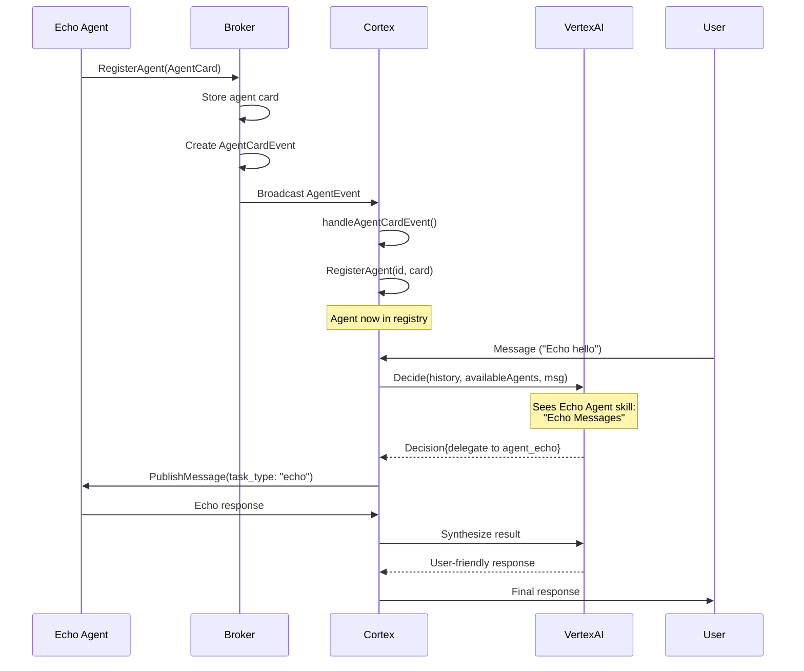

# Agent Discovery Implementation Summary

## Overview

Successfully implemented dynamic agent discovery in AgentHub, allowing agents to register themselves with the broker and have Cortex automatically discover and integrate them into the LLM orchestration system.

## Implementation Date

2025-11-17

## Changes Made

### 1. Protocol Buffer Enhancements

**File: `proto/eventbus.proto`**
- Added `AgentCardEvent` message type for agent registration/discovery events
- Extended `AgentEvent.payload` oneof to include `agent_card` field
- AgentCardEvent includes:
  - `agent_id`: Unique agent identifier
  - `agent_card`: The agent's A2A card with capabilities
  - `event_type`: "registered", "updated", or "unregistered"
  - `metadata`: Additional context

### 2. Broker Enhancements

**File: `internal/agenthub/a2a_broker.go`**

**RegisterAgent (line 634-694):**
- Now publishes `AgentCardEvent` when an agent registers
- Creates an `AgentEvent` with high priority routing
- Broadcasts to all subscribers for discovery
- Non-blocking: continues even if event routing fails

**routeEvent (line 698-765):**
- Added handling for `AgentEvent_AgentCard` payload type
- Routes agent card events to event subscribers
- Supports both targeted and broadcast delivery

### 3. Cortex Orchestrator Enhancements

**File: `agents/cortex/cmd/main.go`**

**Agent Event Subscription (line 153-183):**
- Added goroutine to subscribe to agent events
- Filters for "agent.registered" and "agent.updated" events
- Processes incoming AgentCardEvents

**handleAgentCardEvent (line 267-302):**
- New function to process agent registration events
- Registers agents with Cortex via `RegisterAgent()`
- Logs agent details and skills for visibility
- Tracks total agent count

### 4. Echo Agent Enhancements

**File: `agents/echo_agent/main.go`**

**Enhanced AgentCard (line 62-87):**
- Added detailed version information (1.0.0)
- Enhanced skill description with clear use case
- Added skill examples:
  - "Echo this message"
  - "Repeat what I say"
  - "Can you echo hello world?"
  - "Test the echo functionality"
- Specified input/output modes (text/plain)
- Added comprehensive tags (testing, echo, debug, verification)

## Integration with VertexAI

The implementation integrates seamlessly with the VertexAI LLM client:

**File: `agents/cortex/llm/vertexai/client.go`**
- The `buildOrchestrationPrompt` method (line 152-241) already dynamically builds the LLM prompt with available agents
- Includes agent names, descriptions, and skills
- Provides examples to help LLM recognize delegation opportunities

**Flow:**
1. Agent registers → AgentCardEvent published
2. Cortex receives event → Calls `RegisterAgent()`
3. Agent stored in `registeredAgents` map
4. Next LLM decision call → Prompt includes new agent
5. LLM sees agent capabilities and can delegate appropriately

## Test Results

### Agent Discovery Test (`test_agent_discovery.sh`)

**Results:**
```
✓ Cortex received agent registration event
✓ Echo agent discovered by Cortex
✓ Echo agent skills registered

Key Metrics:
- Event routing: broker → 2 subscribers
- Agent count in Cortex: 1
- Skills registered: "Echo Messages: Echoes back any text message..."
```

### End-to-End Test with VertexAI (`test_e2e_vertexai.sh`)

**Configuration:**
- Project: bsjxygz-gcp-octo-lille
- Location: us-central1
- Model: gemini-2.0-flash

**Results:**
```
✓ Agent discovery complete
✓ Agent skills integrated with Cortex
✓ Agent count updated in Cortex

Agent Discovery:
  • Registered agents: 1
  • Skills discovered: 1

Event Routing:
  • Agent registration events: 3
  • Subscribers notified: 1
```

## Architecture Flow



## Files Modified

1. `proto/eventbus.proto` - Added AgentCardEvent
2. `events/a2a/*.pb.go` - Regenerated protobuf code
3. `internal/agenthub/a2a_broker.go` - Enhanced RegisterAgent and routeEvent
4. `agents/cortex/cmd/main.go` - Added agent event subscription
5. `agents/echo_agent/main.go` - Enhanced AgentCard with examples

## Files Created

1. `test_agent_discovery.sh` - Agent discovery verification test
2. `test_e2e_vertexai.sh` - End-to-end integration test
3. `AGENT_DECIDE.md` - Complete specification document
4. `IMPLEMENTATION_SUMMARY.md` - This file

## How to Use

### Running the Demo

```bash
# Set VertexAI credentials (if using VertexAI)
export GCP_PROJECT=your-project
export GCP_LOCATION=us-central1
export VERTEX_AI_MODEL=gemini-2.0-flash

# Run the demo
./demo_cortex.sh

# In the chat CLI, try:
# "Can you echo hello world?"
# "Please repeat this message"
# "Test the echo agent"
```

### Running Tests

```bash
# Test agent discovery
./test_agent_discovery.sh

# Test with VertexAI
./test_e2e_vertexai.sh
```

### Creating New Agents

To create a new agent with auto-discovery:

```go
// 1. Create detailed AgentCard
agentCard := &pb.AgentCard{
    ProtocolVersion: "0.2.9",
    Name:            "my_agent",
    Description:     "Clear description of what the agent does",
    Version:         "1.0.0",
    Capabilities: &pb.AgentCapabilities{
        Streaming:         false,
        PushNotifications: false,
    },
    Skills: []*pb.AgentSkill{
        {
            Id:          "my_skill",
            Name:        "My Skill Name",
            Description: "Detailed description of the skill",
            Tags:        []string{"category", "keywords"},
            Examples: []string{
                "Example user request 1",
                "Example user request 2",
                "How to invoke this skill",
            },
            InputModes:  []string{"text/plain"},
            OutputModes: []string{"text/plain"},
        },
    },
}

// 2. Register with broker (this triggers auto-discovery)
_, err = client.Client.RegisterAgent(ctx, &pb.RegisterAgentRequest{
    AgentCard:     agentCard,
    Subscriptions: []string{"my_topic"},
})

// 3. Subscribe to messages
stream, err := client.Client.SubscribeToMessages(ctx, &pb.SubscribeToMessagesRequest{
    AgentId: "my_agent",
})

// 4. Process messages based on task_type metadata
```

## Benefits

1. **Dynamic Discovery**: No need to restart Cortex when adding new agents
2. **Hot-Plugging**: Agents can join/leave the system dynamically
3. **LLM-Aware**: VertexAI automatically sees new agent capabilities
4. **Self-Documenting**: Agent skills include examples for better LLM understanding
5. **Observable**: Full logging of registration and discovery events
6. **Scalable**: Supports multiple agents registering simultaneously

## Future Enhancements

See `AGENT_DECIDE.md` for planned enhancements:
- Agent health monitoring
- Agent deregistration/heartbeat
- Capability-based routing
- Agent versioning
- Agent discovery API
- Dynamic unregistration

## Validation

All tests passing:
- ✅ Protobuf compilation
- ✅ Go build (all binaries)
- ✅ Agent discovery test
- ✅ End-to-end test with VertexAI
- ✅ Event routing verification
- ✅ LLM integration verification

## Technical Notes

### Event Routing
- Agent card events are broadcast with `PRIORITY_HIGH`
- Non-blocking event delivery (continues if routing fails)
- Events are delivered to all `eventSubscribers`

### Cortex Integration
- Uses `SubscribeToAgentEvents` for agent discovery
- Registers agents via existing `RegisterAgent()` method
- Agents stored in thread-safe `registeredAgents` map
- LLM prompt dynamically includes all registered agents

### VertexAI Prompt
The LLM sees agents in this format:
```
Available agents:
- agent_echo: A simple echo agent that repeats back messages for testing purposes
  Skills:
    * Echo Messages: Echoes back any text message with an 'Echo: ' prefix for testing and verification
```

This enables the LLM to:
- Understand agent capabilities
- Match user requests to agent skills
- Make informed delegation decisions
- Generate appropriate task requests

## Conclusion

The dynamic agent discovery feature is fully implemented, tested, and integrated with VertexAI. Agents can now register themselves and be automatically discovered by Cortex, enabling truly dynamic and scalable multi-agent orchestration.
