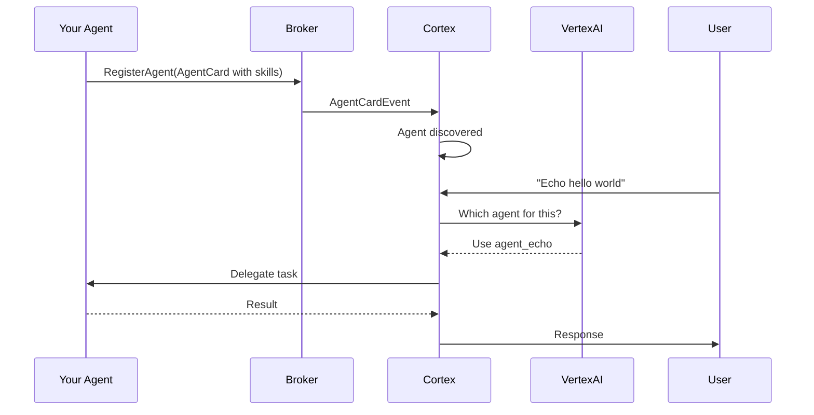

# AgentHub - Event-Driven Architecture with Unified Abstractions

[](https://golang.org/doc/install)
[](https://opentelemetry.io/)
[](https://grpc.io/)
[](observability/)

AgentHub is a high-performance, gRPC-based communication broker that enables autonomous agents to collaborate through structured task exchange. **Now featuring a unified abstraction library** that simplifies development with built-in observability, environment-based configuration, and automatic correlation tracking.

## 🚀 Quick Demo - See AgentHub in Action!

Experience the full observability stack in under 5 minutes:

```bash
# 1. Clone and setup
git clone https://github.com/owulveryck/agenthub.git
cd agenthub

# 2. Load environment configuration (if using direnv)
direnv allow
# OR source manually: source .envrc

# 3. Start the observability stack
cd observability
docker-compose up -d
cd ..

# 4. Run the unified abstraction demo (3 terminals)
# Terminal 1 - Broker with built-in observability
go run broker/main.go

# Terminal 2 - Subscriber agent
go run agents/subscriber/main.go

# Terminal 3 - Publisher agent (sends demo tasks)
go run agents/publisher/main.go
```

**🎯 Instant Results:**
- **Grafana Dashboard**: http://localhost:3333 (admin/admin) - Real-time metrics and visualizations
- **Jaeger Tracing**: http://localhost:16686 - Complete event flow traces
- **Prometheus Metrics**: http://localhost:9090 - Raw metrics and alerts
- **AlertManager**: http://localhost:9093 - Alert management and notifications

## ✨ What Makes AgentHub Special

### 🏗️ **Unified Abstraction Library**
- **Zero Boilerplate**: Built-in gRPC setup with automatic observability
- **Environment-Based Configuration**: Automatic configuration from environment variables
- **Correlation Tracking**: Automatic correlation ID generation and propagation
- **Pluggable Architecture**: Register custom task handlers with ease

### 🔍 **Built-in Observability**
- **Distributed Tracing**: Automatic OpenTelemetry instrumentation
- **Real-time Metrics**: Complete metrics collection with zero configuration
- **Health Monitoring**: Automatic health check endpoints
- **Visual Dashboards**: Beautiful Grafana dashboards for system insights

### ⚡ **High Performance**
- Handles **10,000+ events/second** per agent
- **Sub-millisecond** task routing in local networks
- **< 5% CPU overhead** for full observability
- **< 50MB memory** overhead per agent

### 🎯 **Developer Experience**
- **Simplified APIs**: Main files reduced from 380+ lines to 29 lines
- **Automatic Setup**: One-line broker and client creation
- **Rich Task Semantics**: Built-in support for priorities and deadlines
- **Built-in Resilience** with timeout handling and recovery

## 📊 Live System Visualization

When you run the demo, you'll see:

| **Component** | **What You'll See** | **URL** |
|--------------|-------------------|---------|
| **Grafana Dashboard** | Event processing rates, error rates, latency percentiles, system health | http://localhost:3333 |
| **Jaeger Traces** | Complete event lineage: Publisher → Broker → Subscriber → Results | http://localhost:16686 |
| **Prometheus** | Raw metrics, alert rules, and targets status | http://localhost:9090 |
| **AlertManager** | Alert status, notification routing, and silence management | http://localhost:9093 |
| **Health Checks** | Service health endpoints for all components | Various :808x/health |

## 🏗️ Architecture Overview

```
┌─────────────────┐    ┌─────────────────┐    ┌─────────────────┐
│   Publisher     │    │   AgentHub      │    │   Subscriber    │
│     Agent       │    │    Broker       │    │     Agent       │
│                 │    │                 │    │                 │
│ ● Creates tasks │───▶│ ● Routes tasks  │───▶│ ● Processes     │
│ ● Traces events │    │ ● Manages subs  │    │   tasks         │
│ ● Publishes     │◀───│ ● Handles       │◀───│ ● Reports       │
│   results       │    │   failures      │    │   progress      │
│ ● Exports       │    │ ● Exports       │    │ ● Exports       │
│   metrics       │    │   metrics       │    │   metrics       │
└─────────────────┘    └─────────────────┘    └─────────────────┘
         │                       │                       │
         └───────────────────────┼───────────────────────┘
                                 │
                    ┌─────────────────┐
                    │  Observability  │
                    │     Stack       │
                    │                 │
                    │ ● Jaeger        │
                    │ ● Prometheus    │
                    │ ● Grafana       │
                    │ ● AlertManager  │
                    └─────────────────┘
```

## 🤖 AI-Powered Orchestration with Cortex

AgentHub now includes **Cortex**, an intelligent orchestrator that uses LLMs (Large Language Models) for dynamic agent discovery and task delegation:

### ✨ Key Features

- **🔍 Auto-Discovery**: Agents register themselves with detailed capability descriptions
- **🧠 LLM-Based Routing**: VertexAI intelligently decides which agent handles each task
- **🎯 Zero Configuration**: No hardcoded routing rules or static configurations
- **📝 Self-Documenting**: Agents describe their skills with examples
- **⚡ Hot-Plugging**: Add/remove agents without restarting the system

### Quick Start with Cortex

```bash
# Set up VertexAI credentials
export GCP_PROJECT=your-project
export GCP_LOCATION=us-central1
export VERTEX_AI_MODEL=gemini-2.0-flash

# Run the interactive demo
./demo_cortex.sh

# In the chat CLI, try:
> Can you echo hello world?
> Translate this to Spanish
```

### How It Works



**Learn More:**
- [Create Agent with Cortex](documentation/howto/create_agent_with_cortex.md) - Build auto-discoverable agents
- [Design Agent Cards](documentation/howto/design_agent_cards.md) - Write effective capability descriptions
- [Agent Discovery Workflow](documentation/explanation/agent_discovery_workflow.md) - Understanding the discovery process
- [Complete Specification](AGENT_DECIDE.md) - Technical specification and implementation details

## 📚 Documentation

Our documentation follows the [Diátaxis framework](https://diataxis.fr/) for different learning needs:

### 🎓 [Tutorials](documentation/tutorials/) - *Learn by Doing*
- **[🚀 Observability Demo](documentation/tutorials/observability_demo.md)** - Complete walkthrough of the observability stack with live tracing
- **[📊 Dashboard Tour](documentation/tutorials/dashboard_tour.md)** - Interactive guide to Grafana dashboards and metrics
- **[🔧 Running the Basic Demo](documentation/tutorials/run_demo.md)** - Basic AgentHub functionality without observability

### 🛠️ [How-to Guides](documentation/howto/) - *Practical Solutions*

**Agent Development:**
- **[🤖 Create Agent with Cortex](documentation/howto/create_agent_with_cortex.md)** - Build agents with auto-discovery and LLM orchestration
- **[🎯 Design Effective Agent Cards](documentation/howto/design_agent_cards.md)** - Write AgentCards for optimal LLM matching
- **[📝 Create a Publisher](documentation/howto/create_publisher.md)** - Build task-delegating agents
- **[📥 Create a Subscriber](documentation/howto/create_subscriber.md)** - Build task-processing agents

**Observability:**
- **[📈 Add Observability to Your Agent](documentation/howto/add_observability.md)** - Step-by-step guide to instrument your agents
- **[📊 Use Grafana Dashboards](documentation/howto/use_dashboards.md)** - Master the observability dashboards
- **[🔍 Debug with Distributed Tracing](documentation/howto/debug_with_tracing.md)** - Troubleshoot issues using Jaeger
- **[⚠️ Configure Alerts](documentation/howto/configure_alerts.md)** - Setup monitoring and alerting

### 🧠 [Explanations](documentation/explanation/) - *Understanding the Why*
- **[🔄 Agent Discovery Workflow](documentation/explanation/agent_discovery_workflow.md)** - How dynamic agent discovery works
- **[🤝 The Agent2Agent Principle](documentation/explanation/the_agent_to_agent_principle.md)** - Core communication patterns
- **[📋 Understanding Tasks](documentation/explanation/the_tasks.md)** - Task semantics and lifecycle
- **[🔍 Distributed Tracing & OpenTelemetry](documentation/explanation/distributed_tracing.md)** - Deep dive into observability concepts
- **[🏗️ Go Build Tags](documentation/explanation/go_build_tags.md)** - How AgentHub uses conditional compilation for flexible deployments
- **[🏗️ Observability Architecture](documentation/explanation/observability_architecture.md)** - How the monitoring stack works

### 📖 [Reference](documentation/reference/) - *Technical Specifications*
- **[🏗️ Unified Abstraction API](documentation/reference/unified_abstraction_api.md)** - Complete API reference for the unified abstraction library
- **[📊 Observability Metrics](documentation/reference/observability_metrics.md)** - Complete metrics catalog and usage
- **[🔍 Tracing API](documentation/reference/tracing_api.md)** - OpenTelemetry integration reference
- **[🏥 Health Endpoints](documentation/reference/health_endpoints.md)** - Health check and monitoring APIs
- **[📋 Task Reference](documentation/reference/the_tasks.md)** - Complete task message specifications

## ⚙️ Configuration

AgentHub uses environment variables for configuration. The project includes a `.envrc` file with sensible defaults.

### Environment Variables

| **Variable** | **Default** | **Description** |
|--------------|-------------|-----------------|
| `AGENTHUB_BROKER_ADDR` | `localhost` | Broker server address |
| `AGENTHUB_BROKER_PORT` | `50051` | Broker gRPC port |
| `JAEGER_ENDPOINT` | `127.0.0.1:4317` | Jaeger OTLP endpoint for traces |
| `PROMETHEUS_PORT` | `9090` | Prometheus metrics port |
| `GRAFANA_PORT` | `3333` | Grafana dashboard port |
| `ALERTMANAGER_PORT` | `9093` | AlertManager web interface port |
| `BROKER_HEALTH_PORT` | `8080` | Broker health check port |
| `PUBLISHER_HEALTH_PORT` | `8081` | Publisher health check port |
| `SUBSCRIBER_HEALTH_PORT` | `8082` | Subscriber health check port |
| `OTLP_GRPC_PORT` | `4320` | OpenTelemetry Collector gRPC port |
| `OTLP_HTTP_PORT` | `4321` | OpenTelemetry Collector HTTP port |
| `SERVICE_VERSION` | `1.0.0` | Service version for telemetry |
| `ENVIRONMENT` | `development` | Deployment environment |

### Using the Configuration

```bash
# Option 1: Use direnv (recommended)
direnv allow

# Option 2: Source manually
source .envrc

# Option 3: Set individual variables
export JAEGER_ENDPOINT=127.0.0.1:4317
export GRAFANA_PORT=3333
```

### Custom Configuration

To override defaults, either:
1. **Modify `.envrc`** for project-wide changes
2. **Set environment variables** before running commands
3. **Create local overrides** (not committed to git)

```bash
# Example: Use different ports to avoid conflicts
export GRAFANA_PORT=3334
export BROKER_HEALTH_PORT=8083
go run -tags observability broker/main_observability.go
```

## 🛠️ Development

### Prerequisites
- **Go 1.24+** - [Download here](https://golang.org/doc/install)
- **Docker & Docker Compose** - For observability stack
- **Protocol Buffers compiler (protoc)** - [Installation guide](https://grpc.io/docs/protoc-installation/)
- **direnv** (optional) - For automatic environment loading

### Building from Source

```bash
# Generate Protocol Buffer code
make proto

# Build standard binaries
make build

# Build binaries with unified abstractions
go build -o bin/broker broker/main.go
go build -o bin/publisher agents/publisher/main.go
go build -o bin/subscriber agents/subscriber/main.go

# Clean generated files
make clean
```

### Project Structure

```
agenthub/
├── 📊 observability/          # Complete observability stack
│   ├── docker-compose.yml     # Jaeger, Prometheus, Grafana setup
│   ├── grafana/               # Dashboards and provisioning
│   ├── prometheus/            # Metrics collection and alerts
│   └── README.md              # Observability documentation
├── 🔧 internal/
│   ├── grpc/                  # Generated Protocol Buffer code
│   ├── observability/         # Observability package
│   │   ├── config.go          # OpenTelemetry configuration
│   │   ├── handler.go         # Custom slog handler with tracing
│   │   ├── metrics.go         # Metrics management
│   │   ├── tracing.go         # Distributed tracing
│   │   └── healthcheck.go     # Health monitoring
│   └── agenthub/              # 🏗️ Unified abstraction library
│       ├── grpc.go            # AgentHub client/server with environment-based config
│       ├── metadata.go        # Task publishing/processing with correlation tracking
│       ├── metrics.go         # Automatic metrics collection
│       ├── broker.go          # High-level broker service abstraction
│       ├── subscriber.go      # Pluggable subscriber service abstraction
│       └── agenthub_test.go   # Comprehensive test suite
├── 🤖 agents/                 # Sample agent implementations
│   ├── publisher/             # Task publishing agents
│   │   └── main.go            # Publisher with unified abstractions
│   └── subscriber/            # Task processing agents
│       └── main.go            # Subscriber with unified abstractions
├── 🏢 broker/                 # AgentHub broker server
│   └── main.go                # Broker with unified abstractions
├── 📚 documentation/          # Complete documentation suite
├── 🔌 proto/                  # Protocol Buffer definitions
└── 📄 eventflow.md           # Observability specification
```

## 🔍 Observability Features

### Real-time Metrics (47+ metrics)
- **Event Metrics**: Processing rates, errors, latencies
- **System Metrics**: CPU, memory, goroutines
- **Broker Metrics**: Connection health, throughput
- **Custom Metrics**: Application-specific measurements

### Distributed Tracing
- **End-to-end Visibility**: Complete request flow tracking
- **Context Propagation**: Automatic trace correlation
- **Performance Analysis**: Latency breakdowns and bottlenecks
- **Error Correlation**: Link errors across service boundaries

### Intelligent Alerting
- **Critical Alerts**: Error rates, high latency, system health
- **Warning Alerts**: Performance degradation, resource usage
- **Customizable Rules**: Prometheus AlertManager integration

### Health Monitoring
Each service exposes:
- `/health` - Application health status
- `/ready` - Readiness for traffic
- `/metrics` - Prometheus metrics endpoint

## 🎯 Quick Start Options

### Option 1: Full Experience with Unified Abstractions (Recommended)
Perfect for understanding the complete system with simplified code:
```bash
cd observability && docker-compose up -d
go run broker/main.go
go run agents/subscriber/main.go
go run agents/publisher/main.go
```

### Option 2: Basic Functionality (Makefile)
For simple task exchange using the old Makefile commands:
```bash
make run-server     # Terminal 1
make run-subscriber # Terminal 2
make run-publisher  # Terminal 3
```

### Option 3: Custom Development
Start with our templates:
- **[Add Observability Tutorial](documentation/tutorials/observability_demo.md)**
- **[Create Agent How-to](documentation/howto/add_observability.md)**

## 🏆 Performance Characteristics

| **Metric** | **Performance** | **With Observability** |
|------------|-----------------|-------------------------|
| **Throughput** | 10,000+ tasks/sec per agent | 9,500+ tasks/sec per agent |
| **Latency** | Sub-millisecond routing | +10ms for full tracing |
| **CPU Overhead** | Baseline | +5% for observability |
| **Memory Overhead** | Baseline | +50MB per agent |
| **Scalability** | 100+ agents | 100+ agents |

## 🎨 Example: What You'll See

After running the observability demo, your Grafana dashboard will show:

```
📊 Event Processing Rate: 150 events/sec across 3 services
🚨 Error Rate: 0.1% (within healthy thresholds)
⏱️  Processing Latency: p95 < 100ms, p99 < 250ms
💾 Memory Usage: Broker 45MB, Agents 35MB each
🔄 Active Traces: 50+ traces showing complete event journeys
📈 System Health: All services UP, 0 failed health checks
```

## 🤝 Contributing

We welcome contributions! Please:

1. Follow the [documentation guidelines](CLAUDE.md)
2. Ensure observability integration for new components
3. Add tests for both functionality and observability
4. Update relevant documentation sections

### Documentation Standards
- **Tutorials** for step-by-step learning
- **How-to guides** for specific problems
- **Explanations** for deeper understanding
- **Reference** for technical specifications

## 🚨 Troubleshooting

| **Issue** | **Quick Fix** | **Deep Dive** |
|-----------|---------------|---------------|
| High error rates | Check Jaeger traces for root cause | [Debug with Tracing Guide](documentation/howto/debug_with_tracing.md) |
| Dashboard not loading | Verify Prometheus connection | [Dashboard Troubleshooting](documentation/howto/use_dashboards.md#troubleshooting) |
| Missing traces | Check OpenTelemetry configuration | [Tracing Reference](documentation/reference/tracing_api.md) |
| Performance issues | Analyze metrics and spans | [Performance Tuning](documentation/explanation/observability_architecture.md#performance) |

## 📄 License

This project is licensed under the MIT License - see the [LICENSE](LICENSE) file for details.

---

## 🎯 Ready to Experience Full Observability?

**Start Here:** **[🚀 Observability Demo Tutorial](documentation/tutorials/observability_demo.md)** - See distributed tracing, real-time metrics, and intelligent alerting in action!

**For Production:** **[📈 Add Observability to Your Agent](documentation/howto/add_observability.md)** - Integrate observability into your existing agents.

**Need Help?** **[🧠 Distributed Tracing Explained](documentation/explanation/distributed_tracing.md)** - Understand the concepts behind modern observability.

