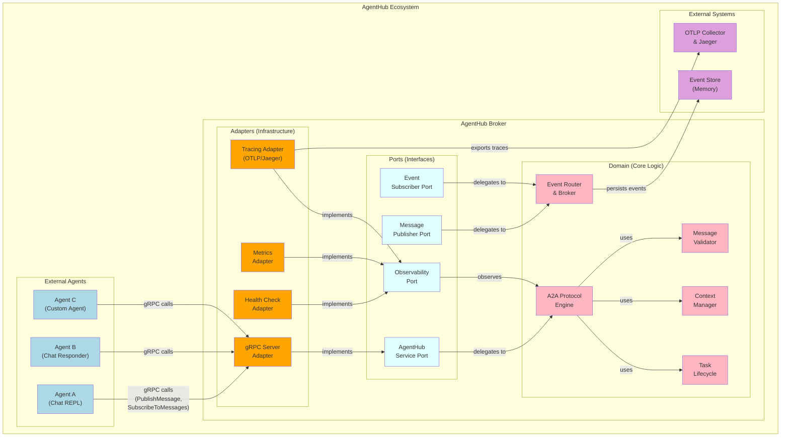
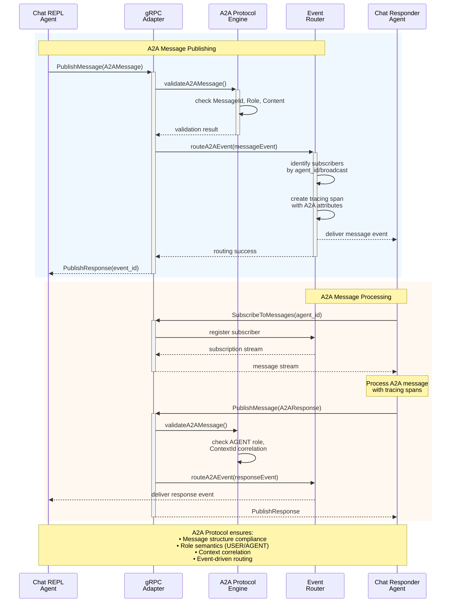
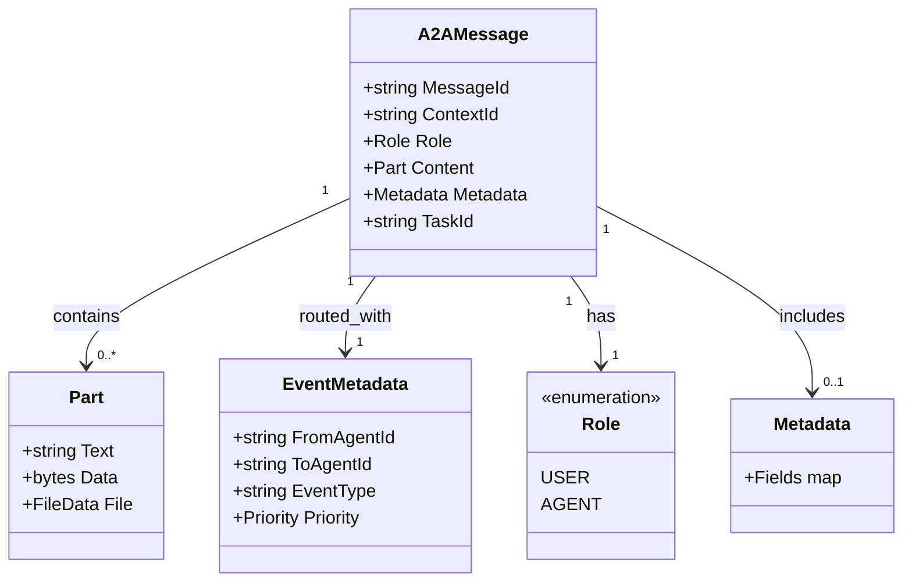
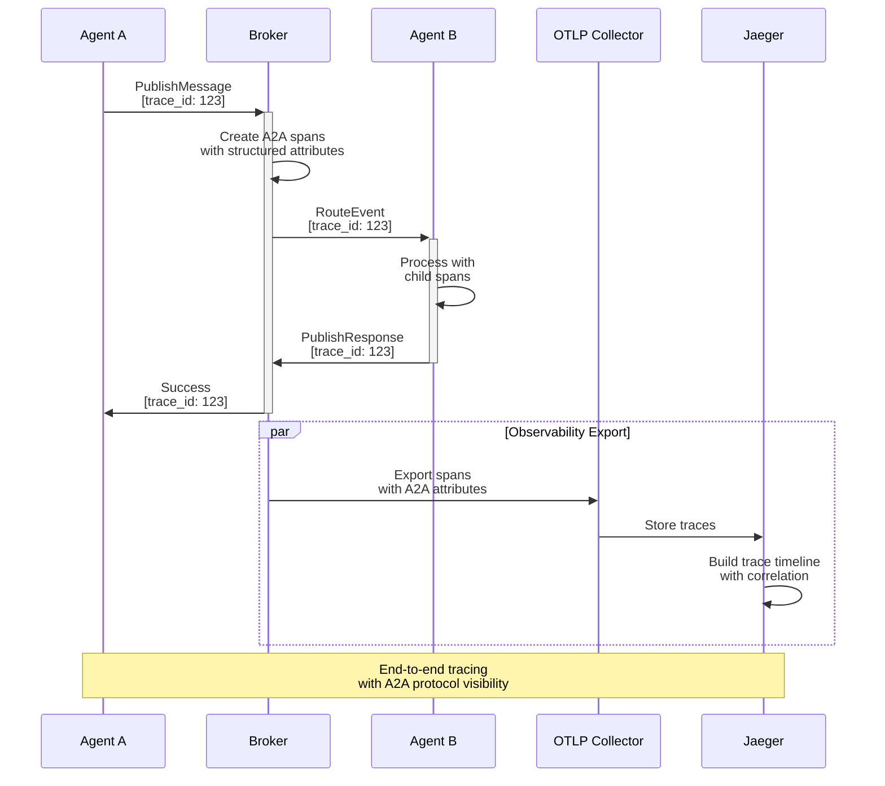

# Hexagonal Architecture & A2A Protocol Implementation

This document explains how AgentHub implements hexagonal architecture principles with the Agent2Agent (A2A) protocol, gRPC communication, and event-driven design patterns.

## Overview

AgentHub follows hexagonal architecture (also known as Ports and Adapters) to achieve:
- **Domain isolation**: Core A2A protocol logic separated from infrastructure
- **Testability**: Clean interfaces enable comprehensive testing
- **Flexibility**: Multiple adapters for different communication protocols
- **Maintainability**: Clear separation of concerns and dependencies

## System Architecture



**Architecture Notes:**
- **Domain Core**: Pure A2A protocol logic with message validation, event routing, context correlation, and task state management
- **Ports**: Clean, technology-agnostic interfaces providing testable contracts and dependency inversion
- **Adapters**: Infrastructure concerns including gRPC communication, observability exports, and protocol adaptations

## A2A Message Flow



## Core Components

### 1. A2A Protocol Engine (Domain Core)

The heart of the system implementing A2A protocol specifications:

```go
// Core domain logic - technology agnostic
type A2AProtocolEngine struct {
    messageValidator MessageValidator
    contextManager   ContextManager
    taskLifecycle    TaskLifecycle
}

// A2A message validation
func (e *A2AProtocolEngine) ValidateMessage(msg *Message) error {
    // A2A compliance checks
    if msg.MessageId == "" { return ErrMissingMessageId }
    if msg.Role == ROLE_UNSPECIFIED { return ErrInvalidRole }
    if len(msg.Content) == 0 { return ErrEmptyContent }
    return nil
}
```

### 2. Event Router (Domain Core)

Manages event-driven communication between agents:

```go
type EventRouter struct {
    messageSubscribers map[string][]chan *AgentEvent
    taskSubscribers    map[string][]chan *AgentEvent
    eventSubscribers   map[string][]chan *AgentEvent
}

func (r *EventRouter) RouteEvent(event *AgentEvent) error {
    // Route based on A2A metadata
    routing := event.GetRouting()
    subscribers := r.getSubscribers(routing.ToAgentId, event.PayloadType)

    // Deliver with tracing
    for _, sub := range subscribers {
        go r.deliverWithTracing(sub, event)
    }
}
```

### 3. gRPC Adapter (Infrastructure)

Translates between gRPC and domain logic:

```go
type GrpcAdapter struct {
    a2aEngine    A2AProtocolEngine
    eventRouter  EventRouter
    tracer       TracingAdapter
}

func (a *GrpcAdapter) PublishMessage(ctx context.Context, req *PublishMessageRequest) (*PublishResponse, error) {
    // Start tracing span
    ctx, span := a.tracer.StartA2AMessageSpan(ctx, "publish_message", req.Message.MessageId, req.Message.Role)
    defer span.End()

    // Validate using domain logic
    if err := a.a2aEngine.ValidateMessage(req.Message); err != nil {
        a.tracer.RecordError(span, err)
        return nil, err
    }

    // Route using domain logic
    event := a.createA2AEvent(req)
    if err := a.eventRouter.RouteEvent(event); err != nil {
        return nil, err
    }

    return &PublishResponse{Success: true, EventId: event.EventId}, nil
}
```

## Hexagonal Architecture Benefits

### 1. Domain Isolation
- **A2A protocol logic** is pure, testable business logic
- **No infrastructure dependencies** in the core domain
- **Technology-agnostic** implementation

### 2. Adapter Pattern
- **gRPC Adapter**: Handles Protocol Buffer serialization/deserialization
- **Tracing Adapter**: OTLP/Jaeger integration without domain coupling
- **Health Adapter**: Service health monitoring
- **Metrics Adapter**: Prometheus metrics collection

### 3. Port Interfaces
```go
// Clean, testable interfaces
type MessagePublisher interface {
    PublishMessage(ctx context.Context, msg *Message) (*PublishResponse, error)
}

type EventSubscriber interface {
    SubscribeToMessages(ctx context.Context, agentId string) (MessageStream, error)
}

type ObservabilityPort interface {
    StartSpan(ctx context.Context, operation string) (context.Context, Span)
    RecordMetric(name string, value float64, labels map[string]string)
}
```

### 4. Dependency Inversion
- **Domain depends on abstractions** (ports), not concrete implementations
- **Adapters depend on domain** through well-defined interfaces
- **Easy testing** with mock implementations

## A2A Protocol Integration

### Message Structure Compliance



### Event-Driven Architecture
The system implements pure event-driven architecture:

1. **Publishers** emit A2A-compliant events
2. **Broker** routes events based on metadata
3. **Subscribers** receive relevant events
4. **Correlation** through ContextId maintains conversation flow

## Observability Integration

### Distributed Tracing



### Structured Attributes
Each span includes A2A-specific attributes:
- `a2a.message.id`
- `a2a.message.role`
- `a2a.context.id`
- `a2a.event.type`
- `a2a.routing.from_agent`
- `a2a.routing.to_agent`

## Testing Strategy

### Unit Testing (Domain Core)
```go
func TestA2AEngine_ValidateMessage(t *testing.T) {
    engine := NewA2AProtocolEngine()

    // Test A2A compliance
    msg := &Message{
        MessageId: "test_msg_123",
        Role: ROLE_USER,
        Content: []*Part{{Text: "hello"}},
    }

    err := engine.ValidateMessage(msg)
    assert.NoError(t, err)
}
```

### Integration Testing (Adapters)
```go
func TestGrpcAdapter_PublishMessage(t *testing.T) {
    // Mock domain dependencies
    mockEngine := &MockA2AEngine{}
    mockRouter := &MockEventRouter{}

    adapter := NewGrpcAdapter(mockEngine, mockRouter)

    // Test adapter behavior
    resp, err := adapter.PublishMessage(ctx, validRequest)
    assert.NoError(t, err)
    assert.True(t, resp.Success)
}
```

## Conclusion

AgentHub's hexagonal architecture with A2A protocol provides:

1. **Clean Architecture**: Separation of concerns with domain-driven design
2. **A2A Compliance**: Full protocol implementation with validation
3. **Event-Driven Design**: Scalable, loosely-coupled communication
4. **Rich Observability**: Comprehensive tracing and metrics
5. **Testability**: Clean interfaces enable thorough testing
6. **Flexibility**: Easy to extend with new adapters and protocols

This architecture ensures maintainable, scalable, and observable agent communication while maintaining strict A2A protocol compliance.