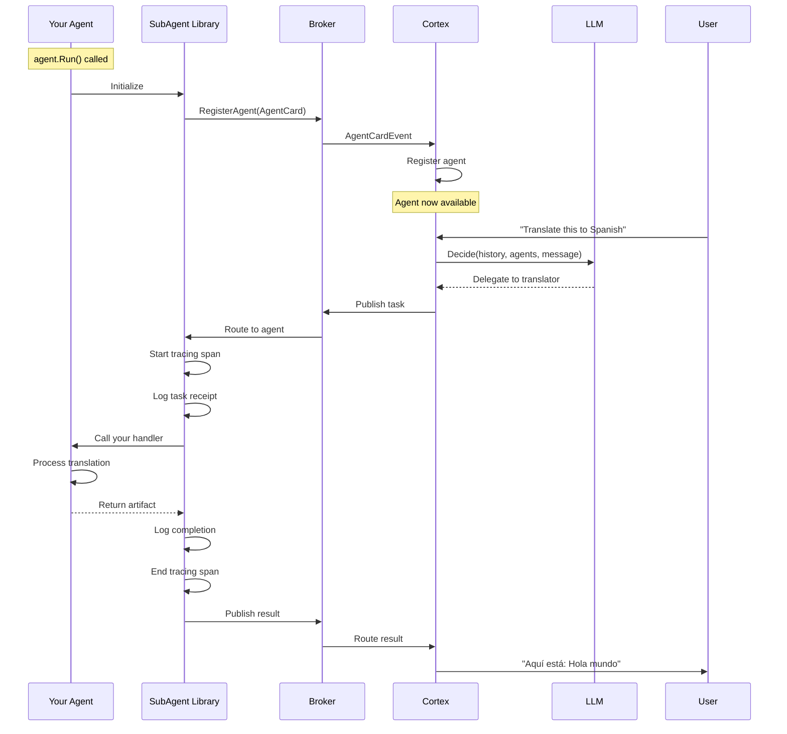

# How to Create an Agent with Cortex Auto-Discovery

This guide shows you how to create an agent using the **SubAgent library**, which handles all the boilerplate and lets you focus on your agent's business logic.

## What You'll Build

An agent that:
- Automatically registers with the broker on startup
- Gets discovered by Cortex for LLM-based task delegation
- Processes delegated tasks and returns results
- Has built-in observability (tracing, logging, metrics)
- Handles graceful shutdown

All with **~50 lines of code** instead of 500+.

## Prerequisites

- AgentHub broker running
- Cortex orchestrator running
- Basic understanding of Go
- Familiarity with the A2A protocol (helpful but not required)

## Step 1: Import the SubAgent Library

```go
package main

import (
    "context"
    "fmt"
    "log"
    "time"

    pb "github.com/owulveryck/agenthub/events/a2a"
    "github.com/owulveryck/agenthub/internal/subagent"
    "google.golang.org/protobuf/types/known/structpb"
)
```

## Step 2: Define Your Agent Configuration

```go
func main() {
    // Configure your agent with required fields
    config := &subagent.Config{
        AgentID:     "agent_translator",     // Unique agent identifier
        ServiceName: "translator_service",    // Optional gRPC service name
        Name:        "Translation Agent",     // Human-readable name
        Description: "Translates text between languages using AI models",
        Version:     "1.0.0",                // Optional, defaults to 1.0.0
        HealthPort:  "8087",                 // Optional, defaults to 8080
    }

    // Create the subagent
    agent, err := subagent.New(config)
    if err != nil {
        log.Fatal(err)
    }
```

## Step 3: Register Your Skills

Skills are capabilities your agent provides. Each skill needs a handler function:

```go
    // Add a translation skill
    agent.MustAddSkill(
        "Language Translation",                    // Skill name (shown to LLM)
        "Translates text from one language to another", // Description
        translateHandler,                          // Your handler function
    )

    // You can add multiple skills
    agent.MustAddSkill(
        "Language Detection",
        "Detects the language of input text",
        detectLanguageHandler,
    )
```

### Best Practices for Skill Definition

1. **Clear Names**: Use descriptive skill names that the LLM can understand
2. **Specific Descriptions**: Explain what the skill does and when to use it
3. **Multiple Skills**: An agent can have multiple related skills

## Step 4: Implement Your Handler Functions

A handler function receives a task and returns a result:

```go
// Handler signature: (ctx, task, message) -> (artifact, state, errorMessage)
func translateHandler(ctx context.Context, task *pb.Task, message *pb.Message) (*pb.Artifact, pb.TaskState, string) {
    // 1. Extract input from the message
    var inputText string
    for _, part := range message.Content {
        if text := part.GetText(); text != "" {
            inputText = text
            break
        }
    }

    if inputText == "" {
        return nil, pb.TaskState_TASK_STATE_FAILED, "No input text provided"
    }

    // 2. Extract parameters from metadata (optional)
    targetLang := "en" // default
    if message.Metadata != nil && message.Metadata.Fields != nil {
        if lang, exists := message.Metadata.Fields["target_language"]; exists {
            targetLang = lang.GetStringValue()
        }
    }

    // 3. Perform your business logic
    translatedText, err := performTranslation(ctx, inputText, targetLang)
    if err != nil {
        return nil, pb.TaskState_TASK_STATE_FAILED, fmt.Sprintf("Translation failed: %v", err)
    }

    // 4. Create an artifact with your result
    artifact := &pb.Artifact{
        ArtifactId:  fmt.Sprintf("translation_%s_%d", task.GetId(), time.Now().Unix()),
        Name:        "translation_result",
        Description: fmt.Sprintf("Translation to %s", targetLang),
        Parts: []*pb.Part{
            {
                Part: &pb.Part_Text{
                    Text: translatedText,
                },
            },
        },
        Metadata: &structpb.Struct{
            Fields: map[string]*structpb.Value{
                "original_text":   structpb.NewStringValue(inputText),
                "target_language": structpb.NewStringValue(targetLang),
                "translated_at":   structpb.NewStringValue(time.Now().Format(time.RFC3339)),
            },
        },
    }

    // 5. Return success
    return artifact, pb.TaskState_TASK_STATE_COMPLETED, ""
}

func performTranslation(ctx context.Context, text, targetLang string) (string, error) {
    // Implement your actual translation logic here
    // This could call an external API, use a local model, etc.

    // Example placeholder:
    return fmt.Sprintf("[Translated to %s]: %s", targetLang, text), nil
}
```

### Handler Return Values

Your handler returns three values:

1. **`*pb.Artifact`**: The result data (or `nil` if failed)
2. **`pb.TaskState`**: Status code (`TASK_STATE_COMPLETED`, `TASK_STATE_FAILED`, etc.)
3. **`string`**: Error message (empty string if successful)

## Step 5: Run Your Agent

```go
    // Run the agent (blocks until shutdown signal)
    if err := agent.Run(context.Background()); err != nil {
        log.Fatal(err)
    }
}
```

That's it! The SubAgent library handles:
- ✅ gRPC client setup and connection
- ✅ Agent card creation with A2A-compliant structure
- ✅ Broker registration and auto-discovery by Cortex
- ✅ Task subscription and routing
- ✅ Distributed tracing (automatic span creation)
- ✅ Structured logging (all operations logged)
- ✅ Graceful shutdown (SIGINT/SIGTERM handling)
- ✅ Health checks
- ✅ Error handling

## Complete Example

Here's a full working agent in ~80 lines:

```go
package main

import (
    "context"
    "fmt"
    "log"
    "time"

    pb "github.com/owulveryck/agenthub/events/a2a"
    "github.com/owulveryck/agenthub/internal/subagent"
    "google.golang.org/protobuf/types/known/structpb"
)

func main() {
    config := &subagent.Config{
        AgentID:     "agent_translator",
        ServiceName: "translator_service",
        Name:        "Translation Agent",
        Description: "Translates text between languages using AI models",
        Version:     "1.0.0",
        HealthPort:  "8087",
    }

    agent, err := subagent.New(config)
    if err != nil {
        log.Fatal(err)
    }

    agent.MustAddSkill(
        "Language Translation",
        "Translates text from one language to another. Supports major languages including English, Spanish, French, German, Japanese, and Chinese",
        translateHandler,
    )

    if err := agent.Run(context.Background()); err != nil {
        log.Fatal(err)
    }
}

func translateHandler(ctx context.Context, task *pb.Task, message *pb.Message) (*pb.Artifact, pb.TaskState, string) {
    var inputText string
    for _, part := range message.Content {
        if text := part.GetText(); text != "" {
            inputText = text
            break
        }
    }

    if inputText == "" {
        return nil, pb.TaskState_TASK_STATE_FAILED, "No input text provided"
    }

    targetLang := "en"
    if message.Metadata != nil && message.Metadata.Fields != nil {
        if lang, exists := message.Metadata.Fields["target_language"]; exists {
            targetLang = lang.GetStringValue()
        }
    }

    translatedText := fmt.Sprintf("[Translated to %s]: %s", targetLang, inputText)

    artifact := &pb.Artifact{
        ArtifactId:  fmt.Sprintf("translation_%s_%d", task.GetId(), time.Now().Unix()),
        Name:        "translation_result",
        Description: fmt.Sprintf("Translation to %s", targetLang),
        Parts: []*pb.Part{
            {Part: &pb.Part_Text{Text: translatedText}},
        },
        Metadata: &structpb.Struct{
            Fields: map[string]*structpb.Value{
                "original_text":   structpb.NewStringValue(inputText),
                "target_language": structpb.NewStringValue(targetLang),
            },
        },
    }

    return artifact, pb.TaskState_TASK_STATE_COMPLETED, ""
}
```

## Build and Test

```bash
# Build your agent
go build -o bin/translator ./agents/translator

# Start broker (if not running)
./bin/broker &

# Start Cortex (if not running)
./bin/cortex &

# Start your agent
./bin/translator
```

### Verify Registration

Check the logs:

```bash
# Your agent logs should show:
time=... level=INFO msg="Agent card registered" agent_id=agent_translator skills=1
time=... level=INFO msg="Agent started successfully" agent_id=agent_translator name="Translation Agent" skills=1

# Cortex logs should show:
time=... level=INFO msg="Received agent card event" agent_id=agent_translator event_type=registered
time=... level=INFO msg="Agent registered with Cortex orchestrator" agent_id=agent_translator total_agents=N
```

### Test with Chat CLI

```bash
./bin/chat_cli

# Try these prompts (if using VertexAI LLM):
> Can you translate "hello world" to Spanish?
> Translate "good morning" to French
```

## How It Works



## Advanced Usage

### Accessing the Client

If you need access to the underlying AgentHub client:

```go
client := agent.GetClient()
logger := agent.GetLogger()
config := agent.GetConfig()
```

### Custom Configuration

```go
config := &subagent.Config{
    AgentID:     "my_agent",
    ServiceName: "custom_service_name",  // Optional
    Name:        "My Agent",
    Description: "Does amazing things",
    Version:     "2.0.0",
    HealthPort:  "9000",
    BrokerAddr:  "broker.example.com",   // Optional
    BrokerPort:  "50051",                // Optional
}
```

### Multiple Skills Example

```go
agent.MustAddSkill("Skill A", "Description A", handlerA)
agent.MustAddSkill("Skill B", "Description B", handlerB)
agent.MustAddSkill("Skill C", "Description C", handlerC)

// Each skill gets its own handler function
// The SubAgent library routes tasks to the correct handler based on task type
```

### Error Handling in Handlers

```go
func myHandler(ctx context.Context, task *pb.Task, message *pb.Message) (*pb.Artifact, pb.TaskState, string) {
    result, err := doWork(ctx, message)
    if err != nil {
        // Return failure with error message
        return nil, pb.TaskState_TASK_STATE_FAILED, err.Error()
    }

    // Return success with result
    artifact := createArtifact(result)
    return artifact, pb.TaskState_TASK_STATE_COMPLETED, ""
}
```

## What the SubAgent Library Provides

### Automatic Setup
- gRPC client connection to broker
- Health check endpoint
- Signal handling for graceful shutdown
- Configuration validation with defaults

### A2A-Compliant AgentCard
- Correct protocol version (0.2.9)
- Proper capabilities structure
- Complete skill definitions with all required fields
- Automatic skill ID generation and tagging

### Observability
- **Tracing**: Automatic span creation for each task with attributes
- **Logging**: Structured logging for all operations (registration, task receipt, completion, errors)
- **Metrics**: Built-in metrics collection (via AgentHub client)

### Task Management
- Automatic task subscription
- Skill-based handler routing
- Error handling and reporting
- Result publishing

### Developer Experience
- Simple 3-step API: `New()` → `AddSkill()` → `Run()`
- Clear error messages
- Type-safe handler functions
- Automatic resource cleanup

## Best Practices

### 1. Skill Design
- **Be specific**: Clear descriptions help the LLM delegate correctly
- **Single responsibility**: Each skill should do one thing well
- **Related skills**: Group related capabilities in one agent

### 2. Handler Implementation
- **Validate input**: Always check that required data is present
- **Handle errors gracefully**: Return meaningful error messages
- **Include metadata**: Add useful context to your artifacts
- **Keep it focused**: Handlers should do one thing

### 3. Configuration
- **Unique ports**: Each agent needs a unique health port
- **Meaningful names**: Use descriptive agent IDs and names
- **Version appropriately**: Use semantic versioning

### 4. Testing
- **Unit test handlers**: Test business logic independently
- **Integration test**: Verify agent works with broker and Cortex
- **E2E test**: Test the complete flow with the LLM

## Troubleshooting

### Build Errors

**Import issues:**
```bash
go mod tidy
go mod download
```

### Agent Not Registering

**Check:**
1. Broker is running and accessible
2. Config has all required fields (AgentID, Name, Description)
3. Health port is not in use by another service
4. Logs for specific error messages

### Tasks Not Reaching Agent

**Check:**
1. Cortex is running and has discovered your agent
2. Skill names and descriptions match what users are asking for
3. LLM is configured (not using mock LLM for delegation)
4. Check broker and Cortex logs for routing events

### Handler Errors

**Check:**
1. Handler function signature matches `TaskHandler` type
2. Input validation is working correctly
3. Error messages are being returned properly
4. Logs show task receipt and processing

## Next Steps

- See the [Echo Agent Example](../../agents/echo_agent/main.go) for a minimal working agent
- Read [Designing Effective Agent Cards](design_agent_cards.md) for skill design guidance
- Explore [SubAgent Library Reference](../reference/subagent_library_api.md) for advanced features
- Check [Distributed Tracing](../observability/add_observability.md) to understand built-in tracing

With the SubAgent library, creating production-ready agents is now as simple as defining your configuration, implementing your business logic, and calling `Run()`!
