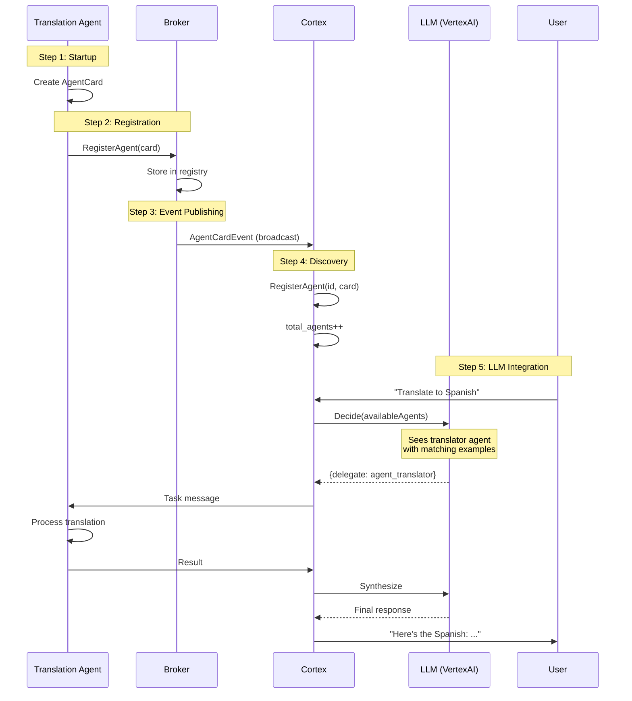

# Agent Discovery Workflow Explained

This document explains how the agent discovery workflow operates in AgentHub, enabling dynamic registration and LLM-based orchestration.

## Overview

Agent discovery is the process by which agents dynamically register their capabilities with the Cortex orchestrator, making themselves available for intelligent task delegation via an LLM (Large Language Model).

## The Problem This Solves

Traditional multi-agent systems require:
- Hard-coded agent configurations
- Static routing rules
- Manual updates when adding new agents
- No intelligence in task routing

Agent discovery with Cortex provides:
- **Dynamic registration**: Agents announce themselves when they start
- **Intelligent routing**: LLM decides which agent to use based on capabilities
- **Zero configuration**: No central registry to update
- **Scalable**: Add or remove agents without system changes

## How It Works

### The Five-Step Flow

```
┌──────────────┐
│ 1. Agent     │ Agent starts and creates an AgentCard
│    Startup   │ describing its capabilities
└──────┬───────┘
       │
       ▼
┌──────────────┐
│ 2. Register  │ Agent calls RegisterAgent RPC
│    with      │ sending the AgentCard to broker
│    Broker    │
└──────┬───────┘
       │
       ▼
┌──────────────┐
│ 3. Event     │ Broker publishes AgentCardEvent
│    Publishing│ broadcasting to all subscribers
└──────┬───────┘
       │
       ▼
┌──────────────┐
│ 4. Cortex    │ Cortex receives event and stores
│    Discovery │ agent in its registry
└──────┬───────┘
       │
       ▼
┌──────────────┐
│ 5. LLM       │ Agent is now available in LLM
│    Integration│ prompts for intelligent delegation
└──────────────┘
```

### Step 1: Agent Startup

When an agent starts, it creates an `AgentCard` that describes:

```go
agentCard := &pb.AgentCard{
    Name:        "agent_translator",
    Description: "Language translation service",
    Version:     "1.0.0",
    Skills: []*pb.AgentSkill{
        {
            Name: "Text Translation",
            Description: "Translates text between languages",
            Examples: [
                "Translate this to Spanish",
                "Convert to French",
            ],
        },
    },
}
```

**Key Components:**
- **Name**: Unique identifier (used for routing)
- **Description**: What the agent does (helps LLM understand)
- **Skills**: Specific capabilities with examples (used for matching)

### Step 2: Registration with Broker

The agent registers by calling the broker's `RegisterAgent` RPC:

```go
client.RegisterAgent(ctx, &pb.RegisterAgentRequest{
    AgentCard:     agentCard,
    Subscriptions: []string{"translation_request"},
})
```

**What happens:**
1. Broker validates the AgentCard
2. Stores agent in its registry: `registeredAgents[agentID] = card`
3. Returns success response

### Step 3: Event Publishing

The broker immediately publishes an `AgentCardEvent`:

```go
event := &pb.AgentEvent{
    EventId:   "agent_registered_translator_...",
    Timestamp: now(),
    Payload: &pb.AgentEvent_AgentCard{
        AgentCard: &pb.AgentCardEvent{
            AgentId:   "agent_translator",
            AgentCard: agentCard,
            EventType: "registered",
        },
    },
    Routing: &pb.AgentEventMetadata{
        FromAgentId: "agent_translator",
        ToAgentId:   "", // Broadcast
        EventType:   "agent.registered",
        Priority:    PRIORITY_HIGH,
    },
}
```

**Routing characteristics:**
- Broadcast to all subscribers (empty `ToAgentId`)
- High priority (processed immediately)
- Event type clearly marked as "agent.registered"

### Step 4: Cortex Discovery

Cortex subscribes to agent events:

```go
stream, _ := client.SubscribeToAgentEvents(ctx, &pb.SubscribeToAgentEventsRequest{
    AgentId:    "cortex",
    EventTypes: []string{"agent.registered", "agent.updated"},
})
```

When receiving an agent card event, Cortex:

```go
func handleAgentCardEvent(event *pb.AgentCardEvent) {
    agentID := event.GetAgentId()
    agentCard := event.GetAgentCard()

    // Store agent
    cortex.RegisterAgent(agentID, agentCard)

    // Log skills for visibility
    log.Info("Agent registered",
        "agent_id", agentID,
        "skills", extractSkillNames(agentCard.Skills))
}
```

**Result**: Agent is now in Cortex's `registeredAgents` map.

### Step 5: LLM Integration

When a user sends a request, Cortex queries the LLM:

```go
decision, _ := llm.Decide(
    conversationHistory,
    availableAgents,  // Includes our new agent!
    newUserMessage,
)
```

The LLM sees:

```
Available agents:
- agent_translator: Language translation service
  Skills:
    * Text Translation: Translates text between languages
      Examples: "Translate this to Spanish", "Convert to French"
```

**Decision making:**
1. User asks: "Can you translate this to Spanish?"
2. LLM sees "agent_translator" with matching examples
3. LLM decides: Delegate to agent_translator
4. Cortex sends task to agent_translator
5. Agent processes and responds
6. Cortex synthesizes final response

## Message Flow Diagram



## Technical Implementation Details

### Thread Safety

Agent registration is thread-safe:

```go
type AgentHubService struct {
    registeredAgents map[string]*pb.AgentCard
    agentsMu         sync.RWMutex
}

func (s *AgentHubService) RegisterAgent(...) {
    s.agentsMu.Lock()
    s.registeredAgents[agentID] = card
    s.agentsMu.Unlock()
}
```

Multiple agents can register concurrently without conflicts.

### Event Delivery

Events are delivered asynchronously:

```go
for _, subChan := range targetChannels {
    go func(ch chan *pb.AgentEvent) {
        select {
        case ch <- event:
            // Delivered
        case <-time.After(5 * time.Second):
            // Timeout
        }
    }(subChan)
}
```

**Benefits:**
- Non-blocking: Broker doesn't wait for all deliveries
- Resilient: Timeout prevents hanging
- Concurrent: Multiple subscribers receive events in parallel

### LLM Prompt Generation

Cortex builds prompts dynamically:

```go
func buildOrchestrationPrompt(availableAgents []*pb.AgentCard) string {
    prompt := "Available agents:\n"

    for _, agent := range availableAgents {
        prompt += fmt.Sprintf("- %s: %s\n",
            agent.Name, agent.Description)

        for _, skill := range agent.Skills {
            prompt += fmt.Sprintf("  Skills:\n")
            prompt += fmt.Sprintf("    * %s: %s\n",
                skill.Name, skill.Description)
        }
    }

    return prompt
}
```

**Updated automatically** when new agents register.

## Timing and Performance

Typical timings for agent discovery:

```
Agent startup:        100-200ms
RegisterAgent RPC:    < 10ms
Event publishing:     < 5ms
Event delivery:       < 50ms
Cortex processing:    < 10ms
Total discovery time: < 300ms
```

**Fast enough** that agents are available for routing within milliseconds of starting.

## Error Handling

### Registration Failures

If registration fails:

```go
_, err := client.RegisterAgent(ctx, req)
if err != nil {
    log.Error("Registration failed", "error", err)
    // Agent should retry or exit
    panic(err)
}
```

Common causes:
- Broker not running
- Network issues
- Invalid AgentCard (empty name)

### Event Delivery Failures

If event delivery fails:

```go
if err := s.routeEvent(ctx, event); err != nil {
    log.Warn("Event routing failed", "error", err)
    // Continue anyway - registration still succeeded
}
```

**Graceful degradation**: Registration succeeds even if event routing fails.

### Cortex Not Subscribed

If Cortex isn't subscribed yet:

- Events are still published
- Cortex can query `GetAgentCard()` RPC later
- Or register when Cortex starts

**Resilient**: System handles various startup orders.

## Observability

### Broker Logs

```
level=INFO msg="Agent registered" agent_id=agent_translator
level=DEBUG msg="Routing event to subscribers"
    event_type=agent.registered subscriber_count=2
level=DEBUG msg="Event delivered to subscriber"
```

### Cortex Logs

```
level=INFO msg="Received agent card event"
    agent_id=agent_translator event_type=registered
level=INFO msg="Agent skills registered"
    skills="[Text Translation: Translates...]"
level=INFO msg="Agent registered with Cortex orchestrator"
    total_agents=3
```

### Distributed Tracing

Agent registration creates trace spans:

```
agent_registered_translator
  └─ broker.route_event
      ├─ deliver_to_cortex
      └─ deliver_to_monitor
```

**Visibility** into the entire discovery flow.

## Lifecycle Management

### Agent Startup Sequence

```
1. Create AgentHub client
2. Connect to broker
3. Create AgentCard
4. Call RegisterAgent
5. Subscribe to messages
6. Enter processing loop
```

### Agent Shutdown

Currently agents don't explicitly unregister. For graceful shutdown:

```go
// In future enhancement:
defer client.UnregisterAgent(ctx, &pb.UnregisterAgentRequest{
    AgentId: myAgentID,
})
```

This would trigger an "agent.unregistered" event.

### Agent Updates

To update capabilities:

```go
// Modify AgentCard
agentCard.Skills = append(agentCard.Skills, newSkill)

// Re-register
client.RegisterAgent(ctx, &pb.RegisterAgentRequest{
    AgentCard: agentCard,
})

// Triggers "agent.updated" event
```

Cortex receives update and refreshes its registry.

## Comparison with Other Patterns

### vs. Service Discovery (Consul, etcd)

**Agent Discovery:**
- Includes capability metadata (skills)
- Optimized for LLM consumption
- Event-driven notification
- Rich semantic information

**Service Discovery:**
- Network location only
- Health checks
- Static metadata
- Pull-based queries

### vs. API Gateway

**Agent Discovery:**
- Dynamic routing based on content
- LLM makes intelligent decisions
- Supports complex multi-step workflows

**API Gateway:**
- Path-based routing
- Static configuration
- Single request-response

### vs. Message Queues

**Agent Discovery:**
- Agents know their capabilities
- Centralized intelligence (Cortex)
- Rich metadata for decisions

**Message Queues:**
- Topic-based routing
- No central intelligence
- Minimal metadata

## Design Decisions

### Why Broadcast Events?

**Decision**: Publish agent cards to all subscribers

**Alternatives considered:**
- Point-to-point to Cortex only
- Store-and-query model

**Rationale:**
- Multiple orchestrators can coexist
- Monitoring agents can track all agents
- Extensible for future use cases
- Low overhead (events are small)

### Why High Priority?

**Decision**: Agent registration events use PRIORITY_HIGH

**Rationale:**
- New agents should be available quickly
- User requests may come immediately
- Discovery is time-sensitive
- Low volume (not many registrations)

### Why Skills with Examples?

**Decision**: Include example user requests in skills

**Rationale:**
- LLMs learn by example
- Natural language is ambiguous
- Examples disambiguate capabilities
- Improves matching accuracy

## Future Enhancements

See [AGENT_DECIDE.md](../../AGENT_DECIDE.md) for planned improvements:

- **Agent Health Monitoring**: Track agent availability
- **Agent Deregistration**: Explicit removal from registry
- **Agent Versioning**: Support multiple versions simultaneously
- **Capability Queries**: Search agents by capability
- **Load Balancing**: Distribute work among multiple instances

## Conclusion

The agent discovery workflow enables:

1. **Zero-configuration** agent deployment
2. **Intelligent routing** via LLM
3. **Dynamic scaling** of agent pools
4. **Automatic orchestration** based on capabilities
5. **Flexible, extensible** multi-agent systems

This architecture supports truly autonomous, self-organizing agent networks that can adapt to changing requirements without manual intervention.

## Related Documentation

- [Create Agent with Cortex](../howto/create_agent_with_cortex.md) - Implementation guide
- [Design Agent Cards](../howto/design_agent_cards.md) - Best practices
- [A2A Protocol](the_agent_to_agent_principle.md) - Protocol specification
- [Cortex Architecture](../docs/content/en/docs/explanation/architecture/cortex_architecture.md) - Orchestrator design
