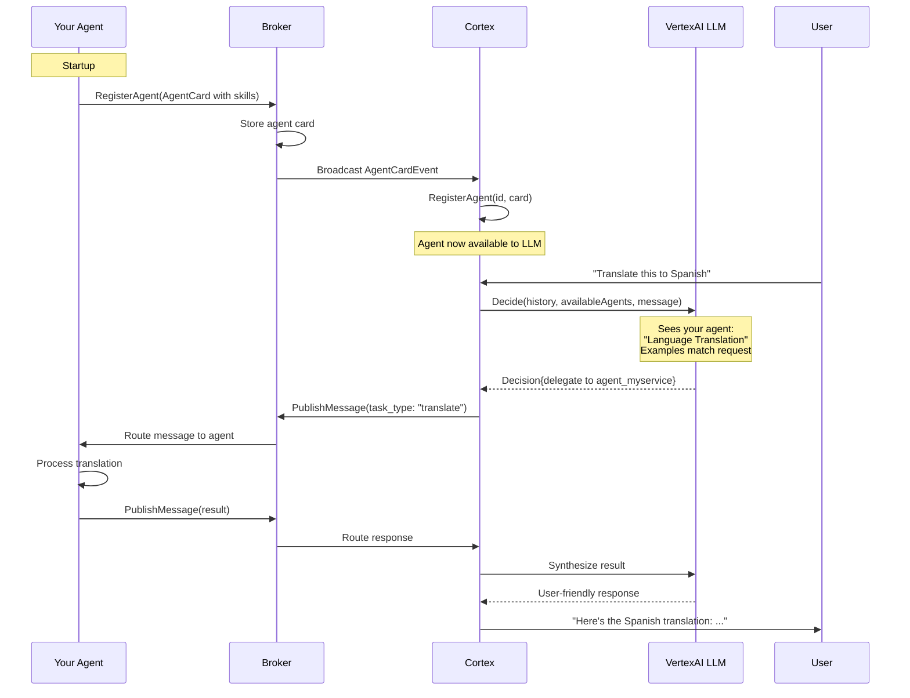

# How to Create an Agent with Cortex Auto-Discovery

This guide shows you how to create an agent that automatically registers itself with the Cortex orchestrator, enabling dynamic discovery and LLM-based task delegation.

## What You'll Build

An agent that:
- Registers itself with the broker on startup
- Sends a detailed AgentCard with skills and examples
- Gets automatically discovered by Cortex
- Becomes available for LLM-based task delegation
- Processes delegated tasks and returns results

## Prerequisites

- AgentHub broker running
- Cortex orchestrator running
- Basic understanding of Go and gRPC
- Familiarity with the A2A protocol

## Step 1: Set Up the Agent Structure

Create your agent's main file:

```go
package main

import (
    "context"
    "fmt"
    "io"
    "os"
    "os/signal"
    "syscall"
    "time"

    pb "github.com/owulveryck/agenthub/events/a2a"
    "github.com/owulveryck/agenthub/internal/agenthub"
    "google.golang.org/protobuf/types/known/structpb"
)

const (
    myAgentID = "agent_myservice"
)

func main() {
    ctx, cancel := context.WithCancel(context.Background())
    defer cancel()

    // Handle graceful shutdown
    sigChan := make(chan os.Signal, 1)
    signal.Notify(sigChan, syscall.SIGINT, syscall.SIGTERM)

    go func() {
        <-sigChan
        fmt.Println("Shutting down agent...")
        cancel()
    }()

    // Create gRPC configuration
    config := agenthub.NewGRPCConfig("myservice")
    config.HealthPort = "8087" // Unique health check port

    // Create AgentHub client
    client, err := agenthub.NewAgentHubClient(config)
    if err != nil {
        panic(fmt.Sprintf("Failed to create AgentHub client: %v", err))
    }

    defer func() {
        shutdownCtx, shutdownCancel := context.WithTimeout(context.Background(), 10*time.Second)
        defer shutdownCancel()
        if err := client.Shutdown(shutdownCtx); err != nil {
            client.Logger.ErrorContext(shutdownCtx, "Error during shutdown", "error", err)
        }
    }()

    // Start the client
    if err := client.Start(ctx); err != nil {
        client.Logger.ErrorContext(ctx, "Failed to start client", "error", err)
        panic(err)
    }

    // Register with Cortex (Step 2)
    registerAgent(ctx, client)

    // Subscribe to messages (Step 3)
    go subscribeToMessages(ctx, client)

    client.Logger.InfoContext(ctx, "Agent ready and registered with Cortex")

    // Keep the service running
    select {
    case <-ctx.Done():
        // Context cancelled, exit gracefully
    }

    client.Logger.InfoContext(ctx, "Agent shutting down")
}
```

## Step 2: Design Your AgentCard

The AgentCard is crucial - it tells Cortex what your agent can do. Design it carefully:

```go
func registerAgent(ctx context.Context, client *agenthub.AgentHubClient) {
    agentCard := &pb.AgentCard{
        // A2A protocol version
        ProtocolVersion: "0.2.9",

        // Unique identifier (must match myAgentID)
        Name: myAgentID,

        // Clear, concise description
        Description: "A service that translates text between languages using AI models",

        // Agent version
        Version: "1.0.0",

        // Capabilities
        Capabilities: &pb.AgentCapabilities{
            Streaming:         false,
            PushNotifications: false,
        },

        // Skills - THIS IS KEY for Cortex/LLM integration
        Skills: []*pb.AgentSkill{
            {
                Id:   "translate",
                Name: "Language Translation",
                Description: "Translates text from one language to another using advanced AI models. " +
                    "Supports major languages including English, Spanish, French, German, Japanese, and Chinese.",
                Tags: []string{"translation", "language", "nlp", "ai"},

                // Examples help the LLM recognize when to use this agent
                Examples: []string{
                    "Translate this text to Spanish",
                    "Can you translate 'hello world' to French?",
                    "I need this paragraph translated to Japanese",
                    "Convert this English text to German",
                    "Translate from Spanish to English",
                },

                InputModes:  []string{"text/plain"},
                OutputModes: []string{"text/plain"},
            },
        },
    }

    // Register with broker - this triggers Cortex auto-discovery
    _, err := client.Client.RegisterAgent(ctx, &pb.RegisterAgentRequest{
        AgentCard:     agentCard,
        Subscriptions: []string{"translation_request"}, // Topic-based routing
    })

    if err != nil {
        client.Logger.ErrorContext(ctx, "Failed to register agent", "error", err)
        panic(err)
    }

    client.Logger.InfoContext(ctx, "Agent registered successfully",
        "agent_id", myAgentID,
        "skills", len(agentCard.Skills),
    )
}
```

### Key AgentCard Design Principles

1. **Clear Description**: Write what the agent does in plain language
2. **Detailed Skills**: Each skill should have:
   - A clear name and description
   - Relevant tags for categorization
   - **Multiple examples** showing different ways users might ask for this capability
   - Input/output modes
3. **Good Examples**: The LLM uses these to match user requests to your agent
   - Include variations (questions, commands, formal, informal)
   - Cover different use cases
   - Be specific about what the agent can do

## Step 3: Subscribe to Messages

Set up message subscription to receive tasks from Cortex:

```go
func subscribeToMessages(ctx context.Context, client *agenthub.AgentHubClient) {
    stream, err := client.Client.SubscribeToMessages(ctx, &pb.SubscribeToMessagesRequest{
        AgentId: myAgentID,
    })

    if err != nil {
        client.Logger.ErrorContext(ctx, "Failed to subscribe to messages", "error", err)
        return
    }

    client.Logger.InfoContext(ctx, "Subscribed to messages")

    for {
        event, err := stream.Recv()
        if err != nil {
            if err == io.EOF {
                client.Logger.InfoContext(ctx, "Message stream ended")
                break
            }
            client.Logger.ErrorContext(ctx, "Error receiving message", "error", err)
            break
        }

        // Process message events
        if messageEvent := event.GetMessage(); messageEvent != nil {
            // Extract trace context for distributed tracing
            eventCtx := ctx
            if event.GetTraceId() != "" && event.GetSpanId() != "" {
                headers := map[string]string{
                    "traceparent": fmt.Sprintf("00-%s-%s-01",
                        event.GetTraceId(), event.GetSpanId()),
                }
                eventCtx = client.TraceManager.ExtractTraceContext(ctx, headers)
            }

            // Check if this message is for us
            if shouldProcessMessage(messageEvent) {
                handleMessage(eventCtx, client, messageEvent)
            }
        }
    }
}

func shouldProcessMessage(message *pb.Message) bool {
    // Check metadata for task type
    if message.Metadata != nil && message.Metadata.Fields != nil {
        if taskType, exists := message.Metadata.Fields["task_type"]; exists {
            taskTypeStr := taskType.GetStringValue()
            // Accept our specific task types
            return taskTypeStr == "translation_request" ||
                   taskTypeStr == "translate"
        }
    }
    return false
}
```

## Step 4: Implement Message Handler

Process incoming messages and return results:

```go
func handleMessage(ctx context.Context, client *agenthub.AgentHubClient, message *pb.Message) {
    // Start tracing
    reqCtx, reqSpan := client.TraceManager.StartA2AMessageSpan(
        ctx,
        "myagent.handle_request",
        message.GetMessageId(),
        message.GetRole().String(),
    )
    defer reqSpan.End()

    client.TraceManager.AddComponentAttribute(reqSpan, "myagent")

    client.Logger.InfoContext(reqCtx, "Received translation request",
        "message_id", message.GetMessageId(),
        "context_id", message.GetContextId(),
        "task_id", message.GetTaskId(),
    )

    // Extract input text
    var inputText string
    if len(message.Content) > 0 {
        inputText = message.Content[0].GetText()
    }

    // Extract translation parameters from metadata
    targetLang := "en" // default
    if message.Metadata != nil && message.Metadata.Fields != nil {
        if lang, exists := message.Metadata.Fields["target_language"]; exists {
            targetLang = lang.GetStringValue()
        }
    }

    client.Logger.InfoContext(reqCtx, "Processing translation",
        "input_length", len(inputText),
        "target_language", targetLang,
    )

    // Perform the actual work (translation)
    translatedText, err := performTranslation(reqCtx, inputText, targetLang)
    if err != nil {
        client.TraceManager.RecordError(reqSpan, err)
        client.Logger.ErrorContext(reqCtx, "Translation failed", "error", err)
        return
    }

    // Create and send response
    sendResponse(reqCtx, client, message, translatedText, targetLang)

    client.TraceManager.SetSpanSuccess(reqSpan)
}

func performTranslation(ctx context.Context, text, targetLang string) (string, error) {
    // Implement your actual translation logic here
    // This could call an external API, use a local model, etc.

    // Example placeholder:
    return fmt.Sprintf("[Translated to %s]: %s", targetLang, text), nil
}

func sendResponse(ctx context.Context, client *agenthub.AgentHubClient,
                  originalMsg *pb.Message, translatedText, targetLang string) {

    responseMessage := &pb.Message{
        MessageId: fmt.Sprintf("msg_%s_response_%d", myAgentID, time.Now().Unix()),
        ContextId: originalMsg.GetContextId(), // Maintain conversation context
        TaskId:    originalMsg.GetTaskId(),    // Maintain task correlation
        Role:      pb.Role_ROLE_AGENT,
        Content: []*pb.Part{
            {
                Part: &pb.Part_Text{
                    Text: translatedText,
                },
            },
        },
        Metadata: &structpb.Struct{
            Fields: map[string]*structpb.Value{
                "task_type":           structpb.NewStringValue("translation_result"),
                "agent_id":            structpb.NewStringValue(myAgentID),
                "target_language":     structpb.NewStringValue(targetLang),
                "original_message_id": structpb.NewStringValue(originalMsg.GetMessageId()),
                "created_at":          structpb.NewStringValue(time.Now().Format(time.RFC3339)),
            },
        },
    }

    // Publish response
    _, err := client.Client.PublishMessage(ctx, &pb.PublishMessageRequest{
        Message: responseMessage,
        Routing: &pb.AgentEventMetadata{
            FromAgentId: myAgentID,
            ToAgentId:   "", // Broadcast for correlation matching
            EventType:   "a2a.message.translation_response",
            Priority:    pb.Priority_PRIORITY_MEDIUM,
        },
    })

    if err != nil {
        client.Logger.ErrorContext(ctx, "Failed to publish response", "error", err)
        return
    }

    client.Logger.InfoContext(ctx, "Published translation response",
        "message_id", responseMessage.GetMessageId(),
        "context_id", responseMessage.GetContextId(),
    )
}
```

## Step 5: Test Your Agent

### Build and Run

```bash
# Build your agent
go build -o bin/myagent ./agents/myagent

# Start broker (if not already running)
./bin/broker &

# Start Cortex (if not already running)
./bin/cortex &

# Start your agent
./bin/myagent
```

### Verify Registration

Check the logs:

```bash
# Your agent logs should show:
# INFO msg="Agent registered successfully" agent_id=agent_myservice skills=1

# Cortex logs should show:
# INFO msg="Received agent card event" agent_id=agent_myservice event_type=registered
# INFO msg="Agent skills registered" agent_id=agent_myservice skills="[Language Translation: ...]"
# INFO msg="Agent registered with Cortex orchestrator" agent_id=agent_myservice total_agents=N
```

### Test with Chat CLI

```bash
# In another terminal, use the chat CLI
./bin/chat_cli

# Try these prompts (if using VertexAI LLM):
> Can you translate "hello world" to Spanish?
> I need this text translated to French
> Translate "good morning" to Japanese
```

## Complete Workflow

Here's what happens when everything is connected:



## Best Practices

### 1. AgentCard Design
- **Be specific**: Clear descriptions help the LLM make better decisions
- **Provide examples**: Include 5-10 varied examples of how users might request this service
- **Use tags**: Categorize your agent for better discovery
- **Version your agent**: Use semantic versioning

### 2. Message Processing
- **Check task_type**: Always verify the message is intended for your agent
- **Validate input**: Don't assume message content is in the expected format
- **Handle errors gracefully**: Return meaningful error messages
- **Maintain context**: Always preserve ContextId and TaskId in responses

### 3. Observability
- **Use tracing**: The AgentHubClient provides built-in tracing
- **Log important events**: Registration, message receipt, processing, responses
- **Add custom attributes**: Use TraceManager to add relevant metadata

### 4. Testing
- **Unit test**: Test message handlers independently
- **Integration test**: Test with broker and Cortex
- **E2E test**: Test the complete flow with the LLM

## Advanced Topics

### Multi-Skill Agents

An agent can have multiple skills:

```go
Skills: []*pb.AgentSkill{
    {
        Id:   "translate",
        Name: "Language Translation",
        // ...
    },
    {
        Id:   "detect_language",
        Name: "Language Detection",
        Description: "Automatically detects the language of input text",
        Examples: []string{
            "What language is this?",
            "Detect the language of this text",
        },
        // ...
    },
},
```

Handle different skills in your message handler:

```go
func shouldProcessMessage(message *pb.Message) bool {
    if message.Metadata != nil && message.Metadata.Fields != nil {
        if taskType, exists := message.Metadata.Fields["task_type"]; exists {
            taskTypeStr := taskType.GetStringValue()
            switch taskTypeStr {
            case "translate", "translation_request":
                return true
            case "detect_language", "language_detection":
                return true
            }
        }
    }
    return false
}
```

### Async Long-Running Tasks

For operations that take time, consider task-based workflows instead of message-based:

```go
// Subscribe to tasks instead of messages
stream, err := client.Client.SubscribeToTasks(ctx, &pb.SubscribeToTasksRequest{
    AgentId: myAgentID,
})

// Send progress updates
client.Client.PublishTaskUpdate(ctx, &pb.PublishTaskUpdateRequest{
    Update: &pb.TaskStatusUpdateEvent{
        TaskId: taskId,
        Status: &pb.TaskStatus{
            State: pb.TaskState_TASK_STATE_WORKING,
            Update: progressMessage,
        },
    },
})
```

### Health Checks

Implement health checks for production deployments:

```go
// The AgentHubClient automatically sets up health checks on the specified port
config := agenthub.NewGRPCConfig("myservice")
config.HealthPort = "8087"

// Health endpoint will be available at http://localhost:8087/health
```

## Troubleshooting

### Agent not showing in Cortex

**Check:**
1. Broker logs for `agent_registered` events
2. Cortex logs for `Received agent card event`
3. Ensure Cortex started before your agent (or wait a few seconds)
4. Verify AgentCard.Name matches your agent ID

### LLM not delegating to your agent

**Check:**
1. AgentCard has clear, detailed skill descriptions
2. Examples cover the types of requests users make
3. VertexAI is configured (not using mock LLM)
4. User requests actually match your agent's capabilities

### Messages not being received

**Check:**
1. SubscribeToMessages is called with correct agent ID
2. Message metadata includes expected `task_type`
3. shouldProcessMessage() logic is correct
4. Check broker logs for routing events

## Next Steps

- Read [Designing Effective Agent Cards](design_agent_cards.md)
- See [Working with A2A Messages](../a2a_protocol/work_with_a2a_messages.md)
- Explore [Distributed Tracing](../observability/add_observability.md)
- Review the [Echo Agent Example](../../agents/echo_agent/main.go)

Your agent is now fully integrated with Cortex and ready for dynamic, LLM-driven task delegation!
